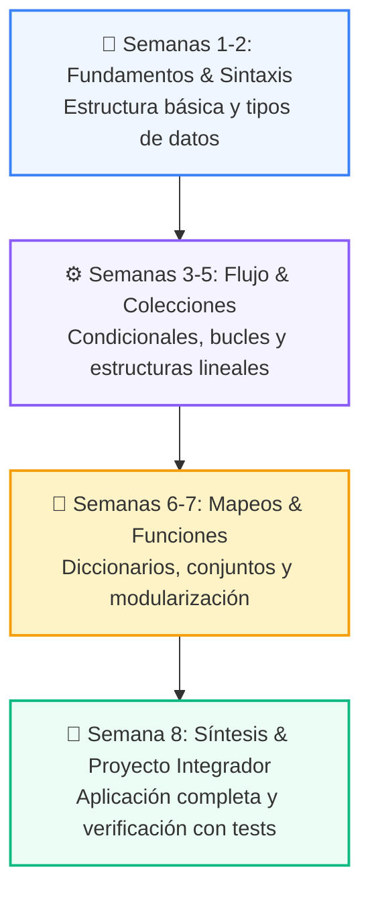

# 📚 Curso 1: Fundamentos Básicos de Python

> **De Cero a Programador: Los 4 Pilares Lógicos, Colecciones y Proyecto CLI**  
> **Nivel:** Nivel 1 (100% Principiantes Absolutos) &bull; **Duración:** 8 Semanas Formativas  
> **Instructor:** **William Rodríguez (Wisrovi)** (AI Solutions Architect & Principal Software Engineer)  

---

## 🗺️ Mapa de Ruta del Curso (8 Semanas)

---

## 📑 Clases del Curso

| Semana | Directorio | Contenido Temático | Metáfora Didáctica |
| :---: | :--- | :--- | :--- |
| **CLASE 01** | [`clase-01-panorama-general/`](clase-01-panorama-general/) | Primer Vistazo Práctico (print, variables, if, for) | *«El Megáfono (print), Las Cajas (variables), El Semáforo (if) y La Cinta Transportadora (for)»* |
| **CLASE 02** | [`clase-02-variables-y-tipos/`](clase-02-variables-y-tipos/) | Variables, Tipos de Datos y Operadores | *«Variables como Cajas Etiquetadas en Memoria»* |
| **CLASE 03** | [`clase-03-control-flujo-condicionales/`](clase-03-control-flujo-condicionales/) | Condicionales (if / elif / else) | *«Condicionales como Semáforos y Bifurcaciones en un Tren»* |
| **CLASE 04** | [`clase-04-control-flujo-bucles/`](clase-04-control-flujo-bucles/) | Bucles (for / while) | *«Bucles como una Cinta Transportadora de Fábrica»* |
| **CLASE 05** | [`clase-05-listas-y-colecciones/`](clase-05-listas-y-colecciones/) | Listas, Tuplas y Colecciones Básicas | *«Listas como Archivadores Modulares y Tuplas como Documentos Notariados»* |
| **CLASE 06** | [`clase-06-diccionarios/`](clase-06-diccionarios/) | Diccionarios y Conjuntos (Sets) | *«Diccionarios como un Casillero con Llaves Únicas»* |
| **CLASE 07** | [`clase-07-funciones/`](clase-07-funciones/) | Funciones, Parámetros y Scope | *«Funciones como Máquinas Reutilizables de una Fábrica»* |
| **CLASE 08** | [`clase-08-proyecto-integrador-basico/`](clase-08-proyecto-integrador-basico/) | Sistema CLI Completo | *«Construyendo tu Primera Aplicación Real de Consola»* |

---

## 📦 Materiales Oficiales del Curso

*   📄 [`curso-01-fundamentos-python.pdf`](curso-01-fundamentos-python.pdf): Manual completo oficial en PDF compilado con estética LaTeX.
*   📖 [`book.md`](book.md): Libro de estudio digital con explicaciones profundas y diagramas Mermaid.
*   🧪 Suite de Pruebas Automatizadas en [`tests/curso_01/`](../tests/curso_01/).
