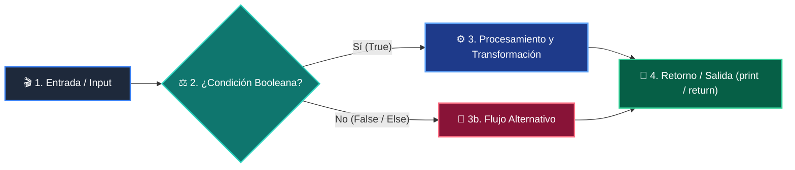
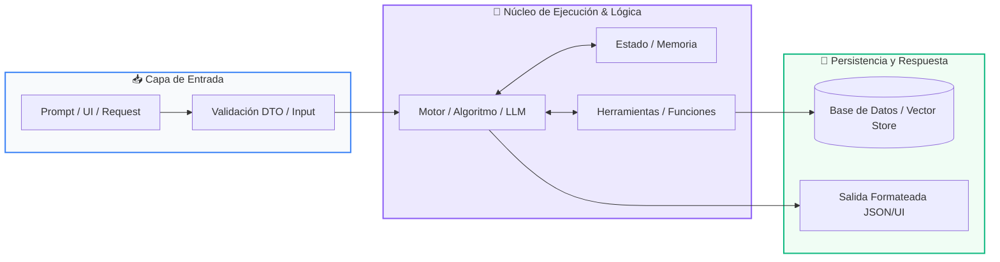

# 📚 Curso 1: Fundamentos Básicos de Python

> **Nivel:** Nivel 1 (100% Principiantes Absolutos)  
> **Enfoque:** De Cero a Programador: Los 4 Pilares Lógicos, Colecciones y Proyecto Integrador  
> **Python Version:** 3.10+ | **Licencia:** MIT  
> **Instructor:** **William Rodríguez (Wisrovi)** (AI Solutions Architect & Principal Software Engineer)  

---

## 👤 Perfil del Instructor y Mentor

### **William Rodríguez (Wisrovi)**
*AI Solutions Architect & Principal Software Engineer &bull; Badajoz, España*

Ingeniero y arquitecto de software especializado en Inteligencia Artificial Generativa, sistemas multi-agente, Visión por Computador e infraestructuras MLOps de alta disponibilidad. Creador y mantenedor de la suite de software libre <strong>wisrovi SUITE</strong> en PyPI con más de 26 bibliotecas enfocadas en orquestación de pipelines, caching distribuido y optimización de bases de datos.

*   🐙 **GitHub:** [github.com/wisrovi](https://github.com/wisrovi)
*   💼 **LinkedIn:** [www.linkedin.com/in/wisrovi-rodriguez/](https://www.linkedin.com/in/wisrovi-rodriguez/)
*   🐳 **DockerHub:** [hub.docker.com/u/wisrovi](https://hub.docker.com/u/wisrovi)
*   🌐 **Website:** [wisrovi.dev](https://wisrovi.dev)
*   📦 **PyPI:** [pypi.org/user/wisrovi/](https://pypi.org/user/wisrovi/)

---

### 🚲 Filosofía de Aprendizaje: La Regla de la Bicicleta

> *"Nadie aprende a montar en bicicleta viendo tutoriales. El verdadero dominio de la programación surge cuando abres tu editor, escribes código con tus propias manos, resuelves errores y construyes proyectos reales."*

---

## 📑 Hoja de Ruta y Tabla de Contenidos del Curso

| Módulo / Clase | Título Temático | Metáfora Central | Enlace a Carpeta |
| :---: | :--- | :--- | :---: |
| **Clase 01** | Clase 01: El Panorama General de la Programación | *El Asistente, las Cajas, el Semáforo y la Licuadora* | [`clase-01-panorama-general/`](clase-01-panorama-general/) |
| **Clase 02** | Clase 02: Variables y Tipos de Datos | *El Almacén, el Collar de Letras y el Micrófono* | [`clase-02-variables-y-tipos/`](clase-02-variables-y-tipos/) |
| **Clase 03** | Clase 03: Control de Flujo - Condicionales | *El Guardia de la Puerta y el Menú de Opciones* | [`clase-03-control-flujo-condicionales/`](clase-03-control-flujo-condicionales/) |
| **Clase 04** | Clase 04: Control de Flujo - Bucles | *Las Vueltas a la Pista y el Termostato* | [`clase-04-control-flujo-bucles/`](clase-04-control-flujo-bucles/) |
| **Clase 05** | Clase 05: Listas y Colecciones de Datos | *La Mochila del Programador y los Casilleros* | [`clase-05-listas-y-colecciones/`](clase-05-listas-y-colecciones/) |
| **Clase 06** | Clase 06: Diccionarios y Mapeos Clave-Valor | *La Agenda Telefónica y el Expediente Médico* | [`clase-06-diccionarios/`](clase-06-diccionarios/) |
| **Clase 07** | Clase 07: Funciones Reutilizables y Modulares | *El Electrodoméstico y la Entrega del Cajero* | [`clase-07-funciones/`](clase-07-funciones/) |
| **Clase 08** | Clase 08: Integración Total & Proyecto Integrador | *El Casco de Seguridad y Salir a Rodar en Bici* | [`clase-08-proyecto-integrador-basico/`](clase-08-proyecto-integrador-basico/) |

---


# 📖 Clase 01: Clase 01: El Panorama General de la Programación

> **Metáfora:** *«El Asistente, las Cajas, el Semáforo y la Licuadora»*  
> **Objetivo:** Comprender que programar es dar instrucciones secuenciales precisas y dominar la función mental de los 4 pilares.  

### 1. Fundamentación y Modelo Mental

Toda aplicación moderna, desde un script de automatización hasta una Inteligencia Artificial, está construida sobre cuatro bloques lógicos elementales.

> [!NOTE]
> **Metáfora Didáctica:** Imagina que la computadora es un asistente súper eficiente pero literal: las variables son cajas etiquetadas donde guarda cosas, el if es un semáforo que decide el camino según la luz, el for es una cinta transportadora que procesa elementos uno a uno, y la función def es una licuadora que recibe ingredientes y entrega un licuado.

1. Variables (Memoria): Espacios con nombre para retener datos temporalmente. 2. Condicionales (Decisión): Bifurcaciones lógicas según condiciones booleanas. 3. Bucles (Repetición): Automatización de tareas repetitivas sin duplicar código. 4. Funciones (Modularidad): Bloques reutilizables con entradas y salidas bien definidas.

La magia del software no radica en la complejidad de cada pieza aislada, sino en la sinergia con la que se combinan para modelar la realidad.

> [!IMPORTANT]
> **Regla de Oro:** Python es un lenguaje interpretado, de tipado dinámico y fuertemente tipado: respeta la indentación y la semántica.

### 2. Arquitectura de Flujo



| Fase | Acción del Intérprete | Estado en Memoria |
| :--- | :--- | :--- |
| **Inicialización** | Lee la instrucción inicial e inicializa el entorno de variables en memoria. | `Tabla de símbolos vacía -> asigna valores` |
| **Evaluación** | Evalúa expresiones booleanas en condicionales para determinar la ruta. | `Evalúa True o False en CPU` |
| **Transformación** | Ejecuta el bloque indentado correspondiente a la condición satisfecha. | `Transformación de variables` |
| **Salida / Retorno** | Invoca funciones y devuelve el resultado a la consola con print(). | `Liberación de stack frame` |

### 3. Implementación en Python

```python
# Clase 01 - main.py
# 1. Definición de Función Reutilizable (La Licuadora)
def evaluar_estudiante(nombre: str, nota: float) -> str:
    if nota >= 7.0:
        return f"¡Felicidades {nombre}! Aprobaste con éxito 🚀"
    else:
        return f"Ánimo {nombre}, debes reforzar los conceptos 📚"

# 2. Variables y Colección (Cajas en memoria)
estudiantes = ["Ana", "Carlos", "Sofía"]
calificaciones = [9.5, 5.8, 8.2]

# 3. Bucle de Procesamiento (Cinta Transportadora)
for i in range(len(estudiantes)):
    resultado = evaluar_estudiante(estudiantes[i], calificaciones[i])
    print(resultado)
```

*El código define una función pura con type hints, itera una colección de datos mediante un bucle for y delega la toma de decisiones al condicional interno.*

### 4. Gotchas Comunes y Buenas Prácticas

> [!WARNING]
> **Trampa de Principiante:** Olvidar los dos puntos (:) al final de las estructuras if, for o def, o mezclar espacios y tabulaciones en la indentación.

*   **❌ Antipatrón:**
    ```python
    if nota > 5
print("Aprobado") # Error de sintaxis
    ```
*   **✅ Patrón Correcto:**
    ```python
    if nota > 5:
    print("Aprobado") # Correcto e indentado
    ```

> [!TIP]
> **Consejo Profesional:** Configura VS Code para insertar 4 espacios automáticos al presionar la tecla Tab y activa el formateador black o ruff.

---


# 📖 Clase 02: Clase 02: Variables y Tipos de Datos

> **Metáfora:** *«El Almacén, el Collar de Letras y el Micrófono»*  
> **Objetivo:** Comprender la diferencia fundamental entre tipos numéricos y texto, y cómo Python asigna memoria dinámicamente.  

### 1. Fundamentación y Modelo Mental

Una variable es un identificador que apunta a una ubicación de memoria donde reside un valor con un tipo de dato específico.

> [!NOTE]
> **Metáfora Didáctica:** Imagina un almacén con cajas etiquetadas. Una caja pequeña guarda números enteros (int), una caja de precisión con decimales guarda números reales (float), una caja larga guarda un collar de letras enhebradas (str) y un interruptor de encendido/apagado representa un valor booleano (bool).

Python utiliza tipado dinámico: no necesitas declarar el tipo de antemano, el intérprete lo infiere en tiempo de asignación.

La función input() SIEMPRE devuelve una cadena de texto (str). Para operar matemáticamente con ella es imperativo hacer casting mediante int() o float().

> [!IMPORTANT]
> **Regla de Oro:** Nunca sumes texto con números sin convertir; '10' + 5 genera TypeError, pero int('10') + 5 produce 15.

### 2. Arquitectura de Flujo


| Fase | Acción del Intérprete | Estado en Memoria |
| :--- | :--- | :--- |
| **Inicialización** | La función input() captura la entrada del teclado como string. | `Buffer de entrada -> '25' (str)` |
| **Evaluación** | La función int() o float() transforma los caracteres en número binario. | `Casting -> 25 (int)` |
| **Transformación** | La ALU del procesador realiza la operación matemática solicitada. | `25 * 2 = 50 en CPU` |
| **Salida / Retorno** | f-string formatea el resultado y lo proyecta en la salida estándar. | `Render en pantalla` |

### 3. Implementación en Python

```python
# Clase 02 - main.py
# Entrada de datos con conversión directa
nombre_usuario: str = input("Ingresa tu nombre: ")
ingreso_mensual: float = float(input("Ingreso mensual ($): "))
porcentaje_ahorro: float = float(input("Porcentaje a ahorrar (%): "))

# Cálculo matemático
monto_ahorro: float = ingreso_mensual * (porcentaje_ahorro / 100.0)
es_meta_alta: bool = monto_ahorro >= 500.0

# Salida formateada con f-strings
print(f"
--- Reporte Financiero de {nombre_usuario} ---")
print(f"Ahorro estimado: ${monto_ahorro:,.2f}")
print(f"¿Es un ahorro significativo?: {es_meta_alta}")
```

*Se declaran variables con anotaciones de tipo, se realiza casting explícito con float() y se formatea el número a dos decimales con ${monto_ahorro:,.2f}.*

### 4. Gotchas Comunes y Buenas Prácticas

> [!WARNING]
> **Trampa de Principiante:** Intentar convertir una cadena con caracteres alfabéticos a int (ej: int('hola')), lo cual dispara un ValueError.

*   **❌ Antipatrón:**
    ```python
    edad = input('Edad: ')
total = edad + 5 # TypeError: str + int
    ```
*   **✅ Patrón Correcto:**
    ```python
    edad = int(input('Edad: '))
total = edad + 5 # Correcto: suma entera
    ```

> [!TIP]
> **Consejo Profesional:** Usa siempre f-strings (f'Texto {variable}') en lugar del operador + para concatenar texto con variables.

---


# 📖 Clase 03: Clase 03: Control de Flujo - Condicionales

> **Metáfora:** *«El Guardia de la Puerta y el Menú de Opciones»*  
> **Objetivo:** Comprender la evaluación de expresiones booleanas y la exclusión mutua en cadenas if-elif-else.  

### 1. Fundamentación y Modelo Mental

Un programa no es una línea recta; es un camino con encrucijadas donde el flujo toma una dirección según las condiciones.

> [!NOTE]
> **Metáfora Didáctica:** Imagina un guardia en la entrada de un club: revisa tu entrada (if). Si tienes pase VIP entra gratis (if), si tienes entrada general paga boleto (elif), y si no tienes entrada se le deniega el acceso (else).

Operadores relacionales: == (igualdad), != (diferente), > (mayor), < (menor), >= (mayor o igual), <= (menor o igual).

Operadores lógicos: and (ambas condiciones deben ser True), or (al menos una True), not (invierte el valor de verdad).

> [!IMPORTANT]
> **Regla de Oro:** En una cadena if-elif-else, tan pronto como una condición resulta True, se ejecuta su bloque y se omiten todas las demás.

### 2. Arquitectura de Flujo


| Fase | Acción del Intérprete | Estado en Memoria |
| :--- | :--- | :--- |
| **Inicialización** | Evalúa la primera condición del if principal. | `Condición 1: ¿edad >= 18?` |
| **Evaluación** | Si es True, entra al bloque if y salta al final de la estructura. | `Ejecuta bloque prioritario` |
| **Transformación** | Si es False, evalúa secuencialmente los bloques elif. | `Condición 2: ¿tiene_permiso?` |
| **Salida / Retorno** | Si ninguna condición previa fue True, se ejecuta el bloque else por defecto. | `Rama fallback de seguridad` |

### 3. Implementación en Python

```python
# Clase 03 - main.py
salario = float(input("Salario mensual ($): "))
puntaje_credito = int(input("Puntaje crediticio (300-850): "))
tiene_deudas = input("¿Tiene deudas activas? (s/n): ").lower() == "s"

if salario >= 3000.0 and puntaje_credito >= 720 and not tiene_deudas:
    estado = "Aprobado Premium (Tasa de interés preferencial)"
elif salario >= 1800.0 and puntaje_credito >= 650:
    estado = "Aprobado Estándar (Sujeto a verificación)"
elif salario >= 1200.0 or puntaje_credito >= 600:
    estado = "Requiere Codeudor o Aval"
else:
    estado = "Rechazado (No cumple los requisitos mínimos)"

print(f"
Resultado de la solicitud: {estado}")
```

*El código implementa lógica booleana compuesta con and, not y or, garantizando una jerarquía de evaluación limpia.*

### 4. Gotchas Comunes y Buenas Prácticas

> [!WARNING]
> **Trampa de Principiante:** Confundir el operador de asignación (=) con el operador de comparación (==).

*   **❌ Antipatrón:**
    ```python
    if rol = "admin": # SyntaxError
    print("Acceso total")
    ```
*   **✅ Patrón Correcto:**
    ```python
    if rol == "admin": # Comparación correcta
    print("Acceso total")
    ```

> [!TIP]
> **Consejo Profesional:** Aprovecha la evaluación de cortocircuito (short-circuit evaluation) en Python para proteger llamadas riesgosas.

---


# 📖 Clase 04: Clase 04: Control de Flujo - Bucles

> **Metáfora:** *«Las Vueltas a la Pista y el Termostato»*  
> **Objetivo:** Diferenciar con claridad cuándo emplear una iteración acotada (for) vs una iteración gobernada por estado (while).  

### 1. Fundamentación y Modelo Mental

La mayor fortaleza de una computadora es su capacidad para ejecutar una misma tarea millones de veces sin cansarse ni cometer errores.

> [!NOTE]
> **Metáfora Didáctica:** El bucle for es como un atleta que da un número exacto de vueltas a la pista de carreras (5 vueltas definidas). El bucle while es como el termostato de un calentador: funciona continuamente mientras la temperatura esté por debajo de 22 grados, y se detiene automáticamente cuando se alcanza la meta.

Bucle for: Ideal cuando conoces de antemano el número de repeticiones o cuando recorres una colección finita.

Bucle while: Ideal cuando la repetición depende de una condición externa que puede cambiar dinámicamente durante la ejecución.

> [!IMPORTANT]
> **Regla de Oro:** Todo bucle while debe modificar en su cuerpo la variable de control; de lo contrario, se convierte en un bucle infinito que congela el programa.

### 2. Arquitectura de Flujo


| Fase | Acción del Intérprete | Estado en Memoria |
| :--- | :--- | :--- |
| **Inicialización** | Inicializa el índice o evalúa la condición de entrada del bucle. | `Variable de control lista` |
| **Evaluación** | Ejecuta las instrucciones del bloque interno. | `Cálculo en la iteración actual` |
| **Transformación** | Si encuentra 'continue', salta directamente a la siguiente iteración. | `Bypass de código restante` |
| **Salida / Retorno** | Si encuentra 'break', aborta el bucle inmediatamente hacia la siguiente línea externa. | `Salida forzada del ciclo` |

### 3. Implementación en Python

```python
# Clase 04 - main.py
PASSWORD_SECRETA = "python2026"
intentos_maximos = 3
intentos_realizados = 0
acceso_concedido = False

while intentos_realizados < intentos_maximos:
    intento = input(f"Intento [{intentos_realizados + 1}/{intentos_maximos}] - Contraseña: ")
    if intento == PASSWORD_SECRETA:
        acceso_concedido = True
        print("¡Acceso exitoso al sistema! 🔓")
        break
    else:
        print("❌ Contraseña incorrecta.")
        intentos_realizados += 1

if not acceso_concedido:
    print("🚫 Sistema bloqueado por demasiados intentos fallidos.")
```

*Demuestra el uso de contadores incrementales, la instrucción break para salida inmediata y la bandera booleana de estado.*

### 4. Gotchas Comunes y Buenas Prácticas

> [!WARNING]
> **Trampa de Principiante:** Olvidar incrementar el contador en un bucle while, resultando en un bucle infinito que consume el 100% de la CPU.

*   **❌ Antipatrón:**
    ```python
    i = 0
while i < 5:
    print(i) # Olvido de i += 1 -> Bucle infinito
    ```
*   **✅ Patrón Correcto:**
    ```python
    for i in range(5):
    print(i) # Seguro, limpio e idiomático
    ```

> [!TIP]
> **Consejo Profesional:** Prefiere siempre for sobre while cuando conozcas el número de iteraciones o trabajes sobre secuencias.

---


# 📖 Clase 05: Clase 05: Listas y Colecciones de Datos

> **Metáfora:** *«La Mochila del Programador y los Casilleros»*  
> **Objetivo:** Comprender la indexación basada en cero (0-indexed), la mutabilidad de listas y la inmutabilidad de tuplas.  

### 1. Fundamentación y Modelo Mental

En el mundo real rara vez trabajamos con datos aislados; casi siempre gestionamos conjuntos de elementos como listas de clientes, precios o mediciones.

> [!NOTE]
> **Metáfora Didáctica:** Imagina una fila de casilleros escolares numerados desde el 0. En cada casillero puedes guardar lo que quieras. Las listas son casilleros que puedes abrir, cambiar y reordenar (mutables). Las tuplas son cajas de cristal selladas: puedes ver lo que hay dentro, pero nadie puede alterarlo (inmutables).

Indexación: El primer elemento está en el índice 0, y el último en el índice -1.

Slicing: La sintaxis lista[inicio:fin:paso] permite extraer subconjuntos sin modificar la lista original.

> [!IMPORTANT]
> **Regla de Oro:** Las listas son mutables (se modifican en el mismo lugar de memoria); las tuplas son inmutables y ofrecen mayor seguridad e integridad.

### 2. Arquitectura de Flujo


| Fase | Acción del Intérprete | Estado en Memoria |
| :--- | :--- | :--- |
| **Inicialización** | Python asigna un puntero de memoria ordenado a cada elemento. | `['A', 'B', 'C', 'D']` |
| **Evaluación** | Índices positivos: [0]=A, [1]=B, [2]=C, [3]=D. | `Lectura hacia adelante` |
| **Transformación** | Índices negativos: [-1]=D, [-2]=C, [-3]=B, [-4]=A. | `Lectura desde el final` |
| **Salida / Retorno** | Slicing [1:3] extrae los índices 1 y 2 (el límite superior es excluyente). | `Nueva lista: ['B', 'C']` |

### 3. Implementación en Python

```python
# Clase 05 - main.py
carrito: list[str] = ["Laptop", "Mouse", "Teclado"]

# 1. Agregar elementos
carrito.append("Monitor 4K")
carrito.insert(1, "Auriculares")

# 2. Slicing (primeros 3 productos)
prioritarios = carrito[0:3]
print(f"Productos prioritarios: {prioritarios}")

# 3. Eliminar y extraer
eliminado = carrito.pop()
print(f"Producto extraído: {eliminado}")

# 4. Iteración elegante con enumeración
for idx, prod in enumerate(carrito, start=1):
    print(f"{idx}. {prod}")
```

*Uso de métodos nativos append, insert, pop, slicing y la función enumerate() para iteración limpia con índices.*

### 4. Gotchas Comunes y Buenas Prácticas

> [!WARNING]
> **Trampa de Principiante:** Copiar una lista por asignación simple (lista2 = lista1) solo copia la referencia, no los datos.

*   **❌ Antipatrón:**
    ```python
    a = [1, 2, 3]
b = a
b.append(4) # ¡Modifica también la lista 'a'!
    ```
*   **✅ Patrón Correcto:**
    ```python
    a = [1, 2, 3]
b = a.copy() # Copia superficial independiente
b.append(4)
    ```

> [!TIP]
> **Consejo Profesional:** Usa lista[:] o lista.copy() cuando quieras duplicar una lista sin afectar la original.

---


# 📖 Clase 06: Clase 06: Diccionarios y Mapeos Clave-Valor

> **Metáfora:** *«La Agenda Telefónica y el Expediente Médico»*  
> **Objetivo:** Comprender la indexación por clave semántica en lugar de posición numérica y la eficiencia O(1) de las tablas hash.  

### 1. Fundamentación y Modelo Mental

Buscar un dato por su posición (índice 4) es poco intuitivo; en el mundo real buscamos por nombre, correo o ID.

> [!NOTE]
> **Metáfora Didáctica:** Un diccionario es como tu agenda del teléfono: no buscas a tu mamá por el número de orden en que la agregaste, buscas la etiqueta 'Mamá' (la clave) y obtienes su número de teléfono (el valor).

Las claves en un diccionario deben ser únicas e inmutables (comúnmente strings o ints). Los valores pueden ser de cualquier tipo, incluidas listas u otros diccionarios.

La búsqueda en un diccionario es instantánea (tiempo constante O(1)) gracias al algoritmo interno de tabla hash.

> [!IMPORTANT]
> **Regla de Oro:** Nunca accedas a una clave con dict['clave'] si no estás 100% seguro de que existe; usa dict.get('clave', valor_por_defecto) para evitar KeyError.

### 2. Arquitectura de Flujo



| Fase | Acción del Intérprete | Estado en Memoria |
| :--- | :--- | :--- |
| **Inicialización** | Python aplica una función hash a la clave (ej: hash('email')). | `Clave -> Hash ID numérico` |
| **Evaluación** | Localiza el casillero exacto en la tabla hash de memoria. | `Búsqueda O(1)` |
| **Transformación** | Recupera o modifica el valor asociado sin recorrer toda la estructura. | `Lectura/Escritura inmediata` |
| **Salida / Retorno** | Permite serialización directa hacia y desde formato JSON para APIs web. | `Compatibilidad universal` |

### 3. Implementación en Python

```python
# Clase 06 - main.py
inventario = {
    "PROD-001": {"nombre": "Teclado Mecánico", "precio": 85.0, "stock": 12},
    "PROD-002": {"nombre": "Mouse Ergonómico", "precio": 45.0, "stock": 0}
}

# Acceso seguro con .get()
sku_buscado = "PROD-001"
producto = inventario.get(sku_buscado, None)

if producto:
    print(f"Producto: {producto['nombre']} | Stock: {producto['stock']} uds")

# Iteración completa de claves y valores
for sku, datos in inventario.items():
    disponible = "En Stock" if datos["stock"] > 0 else "Agotado"
    print(f"[{sku}] {datos['nombre']} -> {disponible}")
```

*Se utiliza una estructura anidada dict-of-dicts, acceso resiliente con get() y desempaquetado de tuplas con el método .items().*

### 4. Gotchas Comunes y Buenas Prácticas

> [!WARNING]
> **Trampa de Principiante:** Consultar una clave inexistente con corchetes (dict['inexistente']) provoca un KeyError que detiene el programa.

*   **❌ Antipatrón:**
    ```python
    user = {'nombre': 'Leo'}
print(user['edad']) # KeyError: 'edad'
    ```
*   **✅ Patrón Correcto:**
    ```python
    user = {'nombre': 'Leo'}
print(user.get('edad', 0)) # Retorna 0 de forma segura
    ```

> [!TIP]
> **Consejo Profesional:** Utiliza dictionary comprehensions ({k: v for k, v in ...}) para filtrar y transformar diccionarios en una sola línea.

---


# 📖 Clase 07: Clase 07: Funciones Reutilizables y Modulares

> **Metáfora:** *«El Electrodoméstico y la Entrega del Cajero»*  
> **Objetivo:** Comprender el principio DRY (Don't Repeat Yourself), la diferencia entre print y return, y el scope local de variables.  

### 1. Fundamentación y Modelo Mental

El código profesional no se escribe dos veces; cuando una lógica se necesita en múltiples lugares, se encapsula en una función.

> [!NOTE]
> **Metáfora Didáctica:** Una función es como un electrodoméstico: tiene una ranura de entrada (parámetros), un motor interno que realiza una tarea específica, y una bandeja de salida donde entrega el resultado terminado (return).

Parámetros vs Argumentos: Los parámetros son los nombres en la firma (def), los argumentos son los valores reales que pasas al invocarla.

Diferencia crucial: print() solo muestra texto en la pantalla pero devuelve None; return devuelve el valor a la variable que llamó a la función para seguir trabajando con él.

> [!IMPORTANT]
> **Regla de Oro:** Una función debe hacer una sola cosa y hacerla excepcionalmente bien (Principio de Responsabilidad Única).

### 2. Arquitectura de Flujo


| Fase | Acción del Intérprete | Estado en Memoria |
| :--- | :--- | :--- |
| **Inicialización** | La función es llamada y se asignan los argumentos a los parámetros. | `Creación del Call Stack Frame` |
| **Evaluación** | Se ejecutan las instrucciones en un ámbito local aislado. | `Variables locales temporales` |
| **Transformación** | La instrucción 'return' finaliza la ejecución de la función y emite el resultado. | `Envío del valor de retorno` |
| **Salida / Retorno** | El stack frame se destruye y la memoria local se libera. | `Retorno al flujo principal` |

### 3. Implementación en Python

```python
# Clase 07 - main.py
def calcular_total_factura(
    subtotal: float,
    tasa_impuesto: float = 0.21,
    descuento: float = 0.0
) -> dict[str, float]:
    """Calcula el desglose final de una factura comercial."""
    monto_descuento = subtotal * descuento
    base_imponible = subtotal - monto_descuento
    impuestos = base_imponible * tasa_impuesto
    total_pagar = base_imponible + impuestos
    
    return {
        "subtotal": subtotal,
        "descuento_aplicado": monto_descuento,
        "impuestos": impuestos,
        "total": round(total_pagar, 2)
    }

# Uso con argumentos por nombre (keyword arguments)
factura = calcular_total_factura(subtotal=150.0, descuento=0.10)
print(f"Total a pagar: ${factura['total']}")
```

*Función pura con parámetros opcionales con valores predeterminados, tipado formal y retorno estructurado en diccionario.*

### 4. Gotchas Comunes y Buenas Prácticas

> [!WARNING]
> **Trampa de Principiante:** Usar argumentos mutables por defecto (como def func(lista=[])); la lista se comparte entre llamadas sucesivas.

*   **❌ Antipatrón:**
    ```python
    def agregar(item, lista=[]): # ¡Peligro mutable!
    lista.append(item)
    return lista
    ```
*   **✅ Patrón Correcto:**
    ```python
    def agregar(item, lista=None):
    if lista is None: lista = []
    lista.append(item)
    return lista
    ```

> [!TIP]
> **Consejo Profesional:** Usa siempre None como valor predeterminado para parámetros que contengan estructuras mutables.

---


# 📖 Clase 08: Clase 08: Integración Total & Proyecto Integrador

> **Metáfora:** *«El Casco de Seguridad y Salir a Rodar en Bici»*  
> **Objetivo:** Comprender cómo se interconectan todos los pilares del lenguaje para crear una aplicación funcional y resiliente.  

### 1. Fundamentación y Modelo Mental

Llegó el momento de unir todas las piezas: variables, condicionales, bucles, listas, diccionarios y funciones trabajando en armonía.

> [!NOTE]
> **Metáfora Didáctica:** Hasta ahora hemos practicado el equilibrio con las rueditas de entrenamiento. Hoy nos quitamos las rueditas, nos ponemos el casco de seguridad y salimos a rodar en la bicicleta por nosotros mismos en el mundo real.

Patrón de Menú Principal: Un bucle infinito while True mantiene viva la aplicación hasta que el usuario decida salir explícitamente.

Capa de Datos: Una lista de diccionarios en memoria actúa como la base de datos temporal de la aplicación.

> [!IMPORTANT]
> **Regla de Oro:** Separa la presentación (print, input) de la lógica de negocio (las funciones que agregan, buscan y transforman datos).

### 2. Arquitectura de Flujo


| Fase | Acción del Intérprete | Estado en Memoria |
| :--- | :--- | :--- |
| **Inicialización** | Bucle principal muestra el menú de opciones (1. Agregar, 2. Listar, 3. Completar, 4. Salir). | `Esperando opción del usuario` |
| **Evaluación** | Enrutador if/elif invoca la función específica según la opción elegida. | `Despacho a función modular` |
| **Transformación** | La función ejecuta la operación CRUD sobre la lista de tareas en memoria. | `Actualización del estado` |
| **Salida / Retorno** | Se muestra retroalimentación visual al usuario y se reinicia el ciclo del menú. | `Ciclo listo para nueva orden` |

### 3. Implementación en Python

```python
# Clase 08 - main.py
tareas: list[dict] = []

def agregar_tarea(titulo: str) -> None:
    nueva_tarea = {"id": len(tareas) + 1, "titulo": titulo, "completada": False}
    tareas.append(nueva_tarea)
    print(f"✅ Tarea #{nueva_tarea['id']} agregada con éxito.")

def listar_tareas() -> None:
    if not tareas:
        print("📭 No hay tareas registradas.")
        return
    for t in tareas:
        estado = "✔️ [LISTA]" if t["completada"] else "⏳ [PENDIENTE]"
        print(f"#{t['id']} - {t['titulo']} {estado}")

def completar_tarea(id_tarea: int) -> None:
    for t in tareas:
        if t["id"] == id_tarea:
            t["completada"] = True
            print(f"🎉 Tarea #{id_tarea} marcada como completada.")
            return
    print("❌ ID de tarea no encontrado.")
```

*Sistema modular que implementa el ciclo CRUD completo, demostrando el dominio integral de las estructuras de datos y funciones.*

### 4. Gotchas Comunes y Buenas Prácticas

> [!WARNING]
> **Trampa de Principiante:** Escribir código espagueti con cientos de líneas sin funciones y mezclando variables globales descontroladas.

*   **❌ Antipatrón:**
    ```python
    # Código monolítico sin funciones ni modularidad
while True:
    op = input()
    # 300 líneas de if/else anidados sin separación
    ```
*   **✅ Patrón Correcto:**
    ```python
    # Código desacoplado
def main():
    while True:
        mostrar_menu()
        procesar_opcion()
    ```

> [!TIP]
> **Consejo Profesional:** Encapsula siempre el punto de entrada de tu programa dentro de if __name__ == '__main__': main().

---


## 🏆 Conclusiones Generales de Curso 1: Fundamentos Básicos de Python

Has completado el manual de referencia completo para este nivel. Continúa profundizando y aplicando estos conceptos en proyectos reales.

### 📚 Bibliografía Oficial y Enlaces Recomendados

| Recurso | Enfoque | Enlace |
| :--- | :--- | :--- |
| **Documentación Oficial de Python** | Referencia canónica del lenguaje | [docs.python.org/3/](https://docs.python.org/3/) |
| **PEP 8 — Style Guide for Python** | Estándar de formato y estilo | [peps.python.org/pep-0008/](https://peps.python.org/pep-0008/) |
| **Real Python Tutorials** | Artículos técnicos y buenas prácticas | [realpython.com](https://realpython.com/) |
| **Suite Open Source wisrovi** | Librerías de alto rendimiento | [github.com/wisrovi](https://github.com/wisrovi) |
