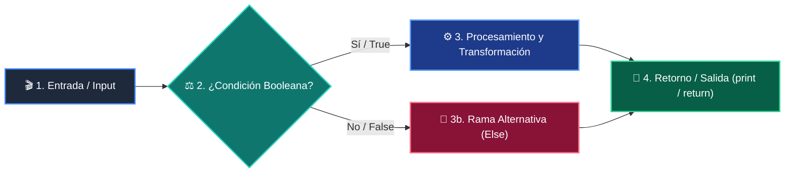
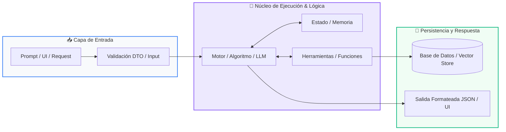

# 📚 Curso 1: Fundamentos Básicos de Python

> **De Cero a Programador: Los 4 Pilares Lógicos, Colecciones y Proyecto CLI**  
> **Nivel:** Nivel 1 (100% Principiantes Absolutos)  
> **Duración:** 8 Semanas (1 Clase por semana)  
> **Instructor:** **William Rodríguez (Wisrovi)** (AI Solutions Architect & Principal Software Engineer)  
> **Licencia:** MIT | **Python:** 3.10+  

---

## 📑 Hoja de Ruta y Tabla de Contenidos (8 Semanas)

| Semana / Clase | Título | Metáfora Central | Carpeta |
| :---: | :--- | :--- | :---: |
| **CLASE 01** | Clase 01: Panorama General y Filosofía de Python | *«Python como Lenguaje de Comunicación Humano-Máquina»* | [`clase-01-panorama-general/`](clase-01-panorama-general/) |
| **CLASE 02** | Clase 02: Variables, Tipos de Datos y Operadores | *«Variables como Cajas Etiquetadas en Memoria»* | [`clase-02-variables-y-tipos/`](clase-02-variables-y-tipos/) |
| **CLASE 03** | Clase 03: Control de Flujo: Condicionales (if / elif / else) | *«Condicionales como Semáforos y Bifurcaciones en un Tren»* | [`clase-03-control-flujo-condicionales/`](clase-03-control-flujo-condicionales/) |
| **CLASE 04** | Clase 04: Control de Flujo: Bucles (for / while) | *«Bucles como una Cinta Transportadora de Fábrica»* | [`clase-04-control-flujo-bucles/`](clase-04-control-flujo-bucles/) |
| **CLASE 05** | Clase 05: Listas, Tuplas y Colecciones Básicas | *«Listas como Archivadores Modulares y Tuplas como Documentos Notariados»* | [`clase-05-listas-y-colecciones/`](clase-05-listas-y-colecciones/) |
| **CLASE 06** | Clase 06: Diccionarios y Conjuntos (Sets) | *«Diccionarios como un Casillero con Llaves Únicas»* | [`clase-06-diccionarios/`](clase-06-diccionarios/) |
| **CLASE 07** | Clase 07: Funciones, Parámetros y Scope | *«Funciones como Máquinas Reutilizables de una Fábrica»* | [`clase-07-funciones/`](clase-07-funciones/) |
| **CLASE 08** | Clase 08: Proyecto Integrador: Sistema CLI Completo | *«Construyendo tu Primera Aplicación Real de Consola»* | [`clase-08-proyecto-integrador-basico/`](clase-08-proyecto-integrador-basico/) |

---


# 📖 CLASE 01: Clase 01: Panorama General y Filosofía de Python

> **Metáfora:** *«Python como Lenguaje de Comunicación Humano-Máquina»*  
> **Objetivo:** Entender cómo el intérprete de Python procesa el código fuente y lo convierte en bytecode.  

### 1. Fundamentos Teóricos
Python es un lenguaje interpretado de alto nivel diseñado para maximizar la legibilidad y productividad del programador.

> [!NOTE]
> **Metáfora Didáctica:** Escribir en Python es como redactar instrucciones claras en un cuaderno que un asistente ejecuta al instante.

El intérprete de Python lee el código de arriba a abajo, lo compila a bytecode y lo ejecuta en la máquina virtual (PVM).

> [!IMPORTANT]
> **Regla de Oro:** La indentación define la jerarquía lógica del código en Python.

### 2. Diagrama de Arquitectura


### 3. Implementación en Python
```python
# CLASE 01
import sys

nombre = "Wisrovi Developer"
version = sys.version_info

print(f"Bienvenido {nombre} a Python {version.major}.{version.minor}")
print("Filosofía: Lo simple es mejor que lo complejo.")
```

### 4. Gotchas y Buenas Prácticas
> [!WARNING]
> **Gotcha:** Mezclar espacios y tabulaciones genera un IndentationError silencioso.

*   **❌ Antipatrón:**
    ```python
def inicio():
	print('Tab')
    print('Espacios')  # ❌ IndentationError
    ```
*   **✅ Patrón Correcto:**
    ```python
def inicio():
    print('Consistente')
    print('4 espacios')  # ✅ PEP 8
    ```

---

# 📖 CLASE 02: Clase 02: Variables, Tipos de Datos y Operadores

> **Metáfora:** *«Variables como Cajas Etiquetadas en Memoria»*  
> **Objetivo:** Comprender el tipado dinámico y fuertemente tipado de Python y la asignación por referencia.  

### 1. Fundamentos Teóricos
En Python, las variables no almacenan el dato directamente, sino una referencia a un objeto en el heap de memoria.

> [!NOTE]
> **Metáfora Didáctica:** Una variable es una etiqueta adhesiva pegada a una caja; varias etiquetas pueden apuntar a la misma caja.

Python es fuertemente tipado: no convierte tipos automáticamente sin orden explícita.

> [!IMPORTANT]
> **Regla de Oro:** Convierte tipos explícitamente usando int() o float() antes de operar con entradas de usuario.

### 2. Diagrama de Arquitectura


### 3. Implementación en Python
```python
# CLASE 02
edad: int = 28
precio: float = 19.99
nombre: str = "Wisrovi"
es_activo: bool = True

total = precio * 2
print(f"Usuario: {nombre} | Total a pagar: ${total:.2f}")
```

### 4. Gotchas y Buenas Prácticas
> [!WARNING]
> **Gotcha:** input() siempre retorna un string; sumarlo directamente concatena texto.

*   **❌ Antipatrón:**
    ```python
edad = input('Edad: ')
total = edad + 5  # ❌ TypeError
    ```
*   **✅ Patrón Correcto:**
    ```python
edad = int(input('Edad: '))
total = edad + 5  # ✅ Correcto
    ```

---

# 📖 CLASE 03: Clase 03: Control de Flujo: Condicionales (if / elif / else)

> **Metáfora:** *«Condicionales como Semáforos y Bifurcaciones en un Tren»*  
> **Objetivo:** Dominar la lógica booleana, cortocircuito lógico (and/or/not) y bifurcación de flujos.  

### 1. Fundamentos Teóricos
Las estructuras condicionales permiten que tu programa tome decisiones autónomas basadas en condiciones booleanas.

> [!NOTE]
> **Metáfora Didáctica:** Un condicional es como una aguja ferroviaria que desvía el tren según el color del semáforo.

Python evalúa las condiciones de forma secuencial; la primera rama que resulte True ejecuta su bloque.

> [!IMPORTANT]
> **Regla de Oro:** Mantén las condiciones planas: evita anidar más de 3 niveles de if.

### 2. Diagrama de Arquitectura


### 3. Implementación en Python
```python
# CLASE 03
puntaje = 85

if puntaje >= 90:
    calificacion = "A - Excelente"
elif puntaje >= 80:
    calificacion = "B - Notable"
elif puntaje >= 70:
    calificacion = "C - Aprobado"
else:
    calificacion = "D - Refuerzo"

print(f"Resultado final: {calificacion}")
```

### 4. Gotchas y Buenas Prácticas
> [!WARNING]
> **Gotcha:** Usar 'is' para comparar números o strings; 'is' compara direcciones de memoria.

*   **❌ Antipatrón:**
    ```python
if nombre is 'Juan':  # ❌ SyntaxWarning
    ```
*   **✅ Patrón Correcto:**
    ```python
if nombre == 'Juan':  # ✅ Comparación correcta
    ```

---

# 📖 CLASE 04: Clase 04: Control de Flujo: Bucles (for / while)

> **Metáfora:** *«Bucles como una Cinta Transportadora de Fábrica»*  
> **Objetivo:** Comprender el protocolo de iteración en Python, range() y control con break y continue.  

### 1. Fundamentos Teóricos
Los bucles permiten ejecutar un bloque de código múltiples veces sobre secuencias o hasta cumplir una condición.

> [!NOTE]
> **Metáfora Didáctica:** El bucle 'for' es como una cinta transportadora donde inspeccionas cada paquete uno a uno hasta terminar.

El bucle 'for' en Python itera directamente sobre los elementos de cualquier objeto iterable.

> [!IMPORTANT]
> **Regla de Oro:** En bucles while, asegúrate siempre de modificar la variable de control para evitar bucles infinitos.

### 2. Diagrama de Arquitectura


### 3. Implementación en Python
```python
# CLASE 04
ventas = [120.0, 45.5, 300.0, 89.9]
total = 0.0

for venta in ventas:
    if venta < 50.0:
        continue
    total += venta

print(f"Total de ventas > $50: ${total:.2f}")
```

### 4. Gotchas y Buenas Prácticas
> [!WARNING]
> **Gotcha:** Hacer .remove() en una lista dentro de un bucle for provoca saltos de elementos.

*   **❌ Antipatrón:**
    ```python
for n in numeros:
    if n % 2 == 0: numeros.remove(n)  # ❌ Muta la colección
    ```
*   **✅ Patrón Correcto:**
    ```python
impares = [n for n in numeros if n % 2 != 0]  # ✅ List comprehension
    ```

---

# 📖 CLASE 05: Clase 05: Listas, Tuplas y Colecciones Básicas

> **Metáfora:** *«Listas como Archivadores Modulares y Tuplas como Documentos Notariados»*  
> **Objetivo:** Diferenciar mutabilidad vs inmutabilidad, indexación positiva y negativa, y slicing.  

### 1. Fundamentos Teóricos
Las listas y tuplas son secuencias ordenadas que permiten almacenar conjuntos estructurados de datos.

> [!NOTE]
> **Metáfora Didáctica:** Una lista es un archivador modular donde agregas carpetas; una tupla es un documento sellado inmutable.

Las listas son mutables (su contenido cambia en memoria sin alterar su id).

> [!IMPORTANT]
> **Regla de Oro:** Si los datos representan una entidad fija que no debe cambiar, usa una tupla.

### 2. Diagrama de Arquitectura


### 3. Implementación en Python
```python
# CLASE 05
inventario = ["Laptop", "Teclado", "Mouse"]
inventario.append("Monitor")
inventario.sort()

primeros_dos = inventario[:2]
print("Inventario ordenado:", inventario)
print("Top 2 productos:", primeros_dos)
```

### 4. Gotchas y Buenas Prácticas
> [!WARNING]
> **Gotcha:** Hacer lista_b = lista_a no crea una copia, crea otro puntero a la misma lista.

*   **❌ Antipatrón:**
    ```python
a = [1, 2, 3]
b = a
b.append(4)  # ❌ Modifica también 'a'
    ```
*   **✅ Patrón Correcto:**
    ```python
a = [1, 2, 3]
b = a.copy()  # ✅ 'a' permanece intacta
    ```

---

# 📖 CLASE 06: Clase 06: Diccionarios y Conjuntos (Sets)

> **Metáfora:** *«Diccionarios como un Casillero con Llaves Únicas»*  
> **Objetivo:** Comprender la estructura clave-valor, tablas hash, acceso O(1) y unicidad en sets.  

### 1. Fundamentos Teóricos
Los diccionarios son colecciones asociativas basadas en pares clave-valor que permiten accesos ultra rápidos.

> [!NOTE]
> **Metáfora Didáctica:** Un diccionario es como un casillero: con tu llave (clave) abres instantáneamente el compartimento (valor).

Las claves deben ser objetos inmutables y hashables (strings, números, tuplas).

> [!IMPORTANT]
> **Regla de Oro:** Usa siempre diccionario.get('clave', default) para evitar excepciones KeyError.

### 2. Diagrama de Arquitectura


### 3. Implementación en Python
```python
# CLASE 06
usuario = {
    "id": 101,
    "nombre": "Carlos Ruiz",
    "roles": {"admin", "editor"},
    "activo": True
}

email = usuario.get("email", "sin_correo@empresa.com")
print(f"Usuario: {usuario['nombre']} | Email: {email}")
```

### 4. Gotchas y Buenas Prácticas
> [!WARNING]
> **Gotcha:** Hacer data['no_existe'] lanza KeyError en lugar de devolver None.

*   **❌ Antipatrón:**
    ```python
data = {'a': 1}
val = data['b']  # ❌ KeyError
    ```
*   **✅ Patrón Correcto:**
    ```python
data = {'a': 1}
val = data.get('b', 0)  # ✅ Seguro
    ```

---

# 📖 CLASE 07: Clase 07: Funciones, Parámetros y Scope

> **Metáfora:** *«Funciones como Máquinas Reutilizables de una Fábrica»*  
> **Objetivo:** Comprender la modularización, paso de parámetros por asignación, valores de retorno y ámbito (LEGB).  

### 1. Fundamentos Teóricos
Las funciones son bloques de código reutilizables diseñados para realizar una tarea específica.

> [!NOTE]
> **Metáfora Didáctica:** Una función es como un electrodoméstico: introduces ingredientes (argumentos) y recibes el resultado (return).

Principio DRY (Don't Repeat Yourself): Si repites código, conviértelo en una función.

> [!IMPORTANT]
> **Regla de Oro:** Toda función debe tener una sola responsabilidad clara.

### 2. Diagrama de Arquitectura


### 3. Implementación en Python
```python
# CLASE 07
def calcular_precio_final(base: float, descuento_pct: float = 0.0, iva_pct: float = 21.0) -> float:
    """Calcula el importe total tras aplicar descuento e impuestos."""
    subtotal = base * (1 - descuento_pct / 100)
    total = subtotal * (1 + iva_pct / 100)
    return round(total, 2)

print("Total:", calcular_precio_final(100.0, descuento_pct=10.0))
```

### 4. Gotchas y Buenas Prácticas
> [!WARNING]
> **Gotcha:** Usar listas o diccionarios vacíos como valores por defecto en la firma.

*   **❌ Antipatrón:**
    ```python
def agregar(item, lista=[]):  # ❌ Se comparte entre llamadas
    lista.append(item)
    return lista
    ```
*   **✅ Patrón Correcto:**
    ```python
def agregar(item, lista=None):  # ✅ Inmutable None
    if lista is None: lista = []
    lista.append(item)
    return lista
    ```

---

# 📖 CLASE 08: Clase 08: Proyecto Integrador: Sistema CLI Completo

> **Metáfora:** *«Construyendo tu Primera Aplicación Real de Consola»*  
> **Objetivo:** Integrar los 4 pilares de la programación en una arquitectura modular de software.  

### 1. Fundamentos Teóricos
El proyecto integrador une todos los conocimientos adquiridos en el Curso 1 para crear una herramienta real.

> [!NOTE]
> **Metáfora Didáctica:** Construir tu primera aplicación es como armar tu propia bicicleta: cada pieza encaja para ponerla en marcha.

Arquitectura modular: Separación de la interfaz de consola de la lógica de negocio.

> [!IMPORTANT]
> **Regla de Oro:** Estructura siempre tu punto de entrada con el patrón estándar if __name__ == '__main__':.

### 2. Diagrama de Arquitectura


### 3. Implementación en Python
```python
# CLASE 08
class TaskManager:
    def __init__(self):
        self.tasks = []

    def add_task(self, title: str):
        self.tasks.append({"id": len(self.tasks) + 1, "title": title, "done": False})

    def list_tasks(self):
        return self.tasks

tm = TaskManager()
tm.add_task("Aprender Python con Wisrovi")
print("Tareas registradas:", tm.list_tasks())
```

### 4. Gotchas y Buenas Prácticas
> [!WARNING]
> **Gotcha:** Escribir todo el código en un solo archivo plano sin funciones ni modularidad.

*   **❌ Antipatrón:**
    ```python
# 500 líneas de código plano desordenado ❌
    ```
*   **✅ Patrón Correcto:**
    ```python
# Funciones modulares y clases con responsabilidades únicas ✅
    ```

---
