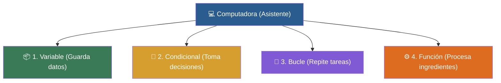

# 🌟 Clase 01: El Panorama General de la Programación

> **Objetivo:** Perder el miedo a programar y dominar de forma intuitiva los 4 pilares de Python: Variables, Condicionales (if), Bucles (for) y Funciones (def).

---

## 💡 Diagrama Conceptual de la Clase

---

## 📚 Ejemplos Prácticos de la Clase

| Ejemplo | Concepto Principal | Metáfora del Mundo Real | Enlace al Material |
| :--- | :--- | :--- | :---: |
| **Ejemplo 01** | Imprimir texto y números en la consola mediante la función print(). | *El Megáfono* | [📁 Ver Ejemplo](ejemplos/ejemplo-01-print-y-mensajes/) |
| **Ejemplo 02** | Creación, asignación y uso de variables (=). | *Cajas de Mudanza* | [📁 Ver Ejemplo](ejemplos/ejemplo-02-variables-cajas-etiquetadas/) |
| **Ejemplo 03** | Toma de decisiones mediante 'if' y 'else'. | *El Guardia de Puerta* | [📁 Ver Ejemplo](ejemplos/ejemplo-03-if-el-semaforo-de-decisiones/) |
| **Ejemplo 04** | Recorrer colecciones de elementos secuencialmente con 'for'. | *Cinta Transportadora de Empaque* | [📁 Ver Ejemplo](ejemplos/ejemplo-04-for-la-cinta-transportadora/) |
| **Ejemplo 05** | Creación y reutilización de bloques de código con funciones. | *La Licuadora* | [📁 Ver Ejemplo](ejemplos/ejemplo-05-funcion-la-licuadora/) |

---

## 🏋️ Ejercicio Práctico de la Clase

Revisa la carpeta de [ejercicios/](ejercicios/) para aplicar los conocimientos adquiridos.
