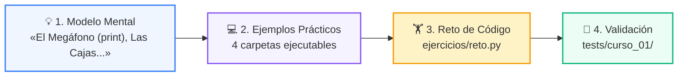
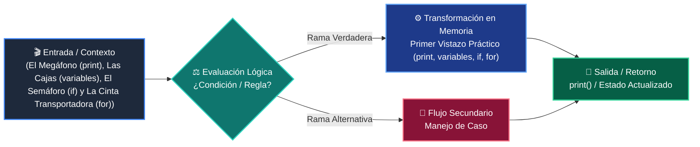

# 📘 Clase 01: Primer Vistazo Práctico (print, variables, if, for)

> **Curso:** Curso 1: Fundamentos Básicos de Python (CLASE 01)  
> **Nivel:** Nivel 1 - Principiante  
> **Metáfora Central:** *«El Megáfono (print), Las Cajas (variables), El Semáforo (if) y La Cinta Transportadora (for)»*  

---

## 🌀 Posición en el Aprendizaje en Espiral

Esta clase aborda los conceptos clave mediante el ciclo de 3 fases:

1. **💡 Modelo Mental:** Aprender a programar es como dominar 4 herramientas esenciales: el Megáfono (print) anuncia resultados, las Cajas (variables) guardan datos, el Semáforo (if) decide qué camino tomar y la Cinta Transportadora (for) procesa elementos uno tras otro.
2. **💻 Experimentación Guiada:** 4+ ejemplos estructurados para correr y depurar.
3. **🏋️ Desafío Práctico:** Reto de consolidación validado con tests.

---

## 🗺️ Arquitectura de la Sesión

---

## 📑 Recursos Disponibles en esta Carpeta

*   📄 [`clase-01-panorama-general.pdf`](clase-01-panorama-general.pdf): Manual técnico oficial en PDF (9 páginas de estudio).
*   📖 [`book.md`](book.md): Libro de estudio digital completo con diagramas Mermaid nativos.
*   📁 [`notebook/`](notebook/): Cuaderno interactivo Jupyter ejecutable en local y en Google Colab con 1 clic.
*   📁 [`ejemplos/`](ejemplos/): 4 carpetas con código fuente funcional y comentado.
*   📁 [`ejercicios/`](ejercicios/): Reto práctico para afianzar conceptos.
