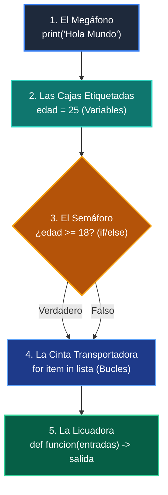

# 📘 Clase 01: Primer Vistazo Práctico (print, variables, if, for)

> **Curso:** Curso 1: Fundamentos Básicos de Python (CLASE 01)  
> **Nivel:** Nivel 1 - Principiante &bull; **Metáfora:** *«El Megáfono (print), Las Cajas (variables), El Semáforo (if) y La Cinta Transportadora (for)»*  

---

## 🗺️ Diagrama de Arquitectura y Flujo de la Clase

---

## 📑 Recursos Disponibles en esta Clase

*   📄 [`clase-01-panorama-general.pdf`](clase-01-panorama-general.pdf): Manual técnico oficial en PDF (9 páginas).
*   📖 [`book.md`](book.md): Libro de estudio digital con teoría profunda y diagramas Mermaid.
*   📁 [`notebook/`](notebook/): Cuaderno interactivo Jupyter ejecutable en local y en Google Colab.
*   📁 [`ejemplos/`](ejemplos/): Carpetas de código funcional con casos prácticos comentados.
*   📁 [`ejercicios/`](ejercicios/): Reto práctico para afianzar conceptos.
