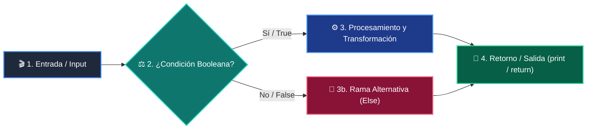

# 📚 Clase 01: Primer Vistazo Práctico (print, variables, if, for)

> **Programa:** Curso 1: Fundamentos Básicos de Python  
> **Nivel:** Nivel 1 - Principiante  
> **Metáfora Central:** *«El Megáfono (print), Las Cajas (variables), El Semáforo (if) y La Cinta Transportadora (for)»*  
> **Documento Oficial PDF:** [clase-01-panorama-general.pdf](clase-01-panorama-general.pdf)  
> **Instructor:** **William Rodríguez (Wisrovi)** (AI Solutions Architect & Principal Software Engineer)  

---

## 👤 Perfil del Autor y Mentor

### **William Rodríguez (Wisrovi)**
*AI Solutions Architect & Principal Software Engineer &bull; Badajoz, España*

Ingeniero y arquitecto de software especializado en Inteligencia Artificial Generativa, sistemas multi-agente, Visión por Computador e infraestructuras MLOps de alta disponibilidad. Creador y mantenedor de la suite de software libre wisrovi SUITE en PyPI con más de 26 bibliotecas enfocadas en orquestación de pipelines, caching distribuido y optimización de bases de datos.

*   🐙 **GitHub:** [github.com/wisrovi](https://github.com/wisrovi)
*   💼 **LinkedIn:** [www.linkedin.com/in/wisrovi-rodriguez/](https://www.linkedin.com/in/wisrovi-rodriguez/)
*   🐳 **DockerHub:** [hub.docker.com/u/wisrovi](https://hub.docker.com/u/wisrovi)
*   🌐 **Website:** [wisrovi.dev](https://wisrovi.dev)
*   📦 **PyPI:** [pypi.org/user/wisrovi/](https://pypi.org/user/wisrovi/)

---

### 🚲 La Regla de la Bicicleta

> *"Nadie aprende a montar en bicicleta viendo tutoriales. El verdadero dominio de la programación surge cuando abres tu editor, escribes código con tus propias manos, resuelves errores y construyes proyectos reales."*

---

## 📑 Tabla de Contenidos de la Sesión

1. [💡 Fundamentación Teórica y Modelo Mental](#1--fundamentación-teórica-y-modelo-mental)
2. [🗺️ Arquitectura y Diagrama de Flujo](#2-️-arquitectura-y-diagrama-de-flujo)
3. [💻 Implementación en Python 3.10+](#3--implementación-en-python-310)
4. [🛡️ Buenas Prácticas y Trampas Frecuentes](#4-️-buenas-prácticas-y-trampas-frecuentes)
5. [🏋️ Desafío de Práctica](#5-️-desafío-de-práctica)
6. [📚 Bibliografía y Enlaces Canónicos](#6--bibliografía-y-enlaces-canónicos)

---

## 1. 💡 Fundamentación Teórica y Modelo Mental

En esta primera clase inaugural abordamos el panorama completo de los 4 pilares fundamentales de Python: cómo mostrar mensajes con print(), cómo almacenar datos en variables, cómo tomar decisiones lógicas con if/else y cómo procesar colecciones con bucles for.

> [!NOTE]
> **🌟 Metáfora Didáctica:** Aprender a programar es como dominar 4 herramientas esenciales: el Megáfono (print) anuncia resultados, las Cajas (variables) guardan datos, el Semáforo (if) decide qué camino tomar y la Cinta Transportadora (for) procesa elementos uno tras otro.

### Principios Fundamentales

1. print() muestra texto y valores numéricos en consola. 2. Las variables reservan espacios con nombre en memoria mediante el operador de asignación '='.

3. if/else evalúa expresiones booleanas (True/False) para bifurcar la ejecución. 4. for recorre secuencias ejecutando el mismo bloque de código para cada elemento.

> [!IMPORTANT]
> **⚡ Regla de Oro en Python:** Todo programa real en Python combina datos (variables), decisiones (if), repetición (for) y salida por pantalla (print).

---

## 2. 🗺️ Arquitectura y Diagrama de Flujo

Flujo de ejecución secuencial, almacenamiento en variables, evaluación de condición y bucle de repetición.



### Desglose Paso a Paso del Flujo

| Fase | Acción del Intérprete | Estado en Memoria |
| :--- | :--- | :--- |
| **1. Inicialización** | Ejecución de print() y reserva de variables en memoria. | `Variables creadas en la tabla de símbolos.` |
| **2. Evaluación** | Evaluación del condicional if / else. | `Rama seleccionada según resultado booleano.` |
| **3. Transformación** | Iteración del bucle for sobre la colección. | `Variable iteradora actualizada paso a paso.` |
| **4. Retorno / Salida** | Impresión final del resumen en consola. | `Ejecución completada con éxito.` |

> [!TIP]
> **🔍 Visualización Mental:** Visualiza la ejecución paso a paso: primero declaras datos, luego decides y finalmente iteras sobre tus elementos.

---

## 3. 💻 Implementación en Python 3.10+

```python
# CLASE 01 - Código de Demostración
# 1. El Megáfono (print)
print("¡Bienvenido al curso de Python!")

# 2. Las Cajas Etiquetadas (variables)
usuario = "Wisrovi"
edad = 25
print(f"Usuario: {usuario} | Edad: {edad} años")

# 3. El Semáforo de Decisiones (if / else)
if edad >= 18:
    print("🚦 Acceso permitido: Eres mayor de edad.")
else:
    print("🚦 Acceso restringido.")

# 4. La Cinta Transportadora (bucle for)
herramientas = ["VS Code", "Terminal", "Git", "Python"]
for item in herramientas:
    print("-> Herramienta configurada:", item)
```

*Uso coordinado de print para salida, variables para memoria, if/else para control de flujo y for para iteración limpia.*

---

## 4. 🛡️ Buenas Prácticas y Trampas Frecuentes

> [!WARNING]
> **⚠️ Gotcha Frecuente (Trampa de Principiante):** Olvidar los dos puntos (:) al final de if o for, o intentar concatenar texto y números con '+' en lugar de usar f-strings.

*   **❌ Antipatrón:**
    ```python
edad = 25
print('Edad: ' + edad)  # ❌ TypeError: can only concatenate str to str
if edad >= 18          # ❌ Falta los dos puntos (:)
    ```

*   **✅ Patrón Correcto:**
    ```python
edad = 25
print(f'Edad: {edad}')  # ✅ F-string formatea automáticamente
if edad >= 18:         # ✅ Sintaxis correcta con dos puntos
    print('Acceso OK')
    ```

> [!TIP]
> **💡 Consejo Profesional:** Usa siempre f-strings f'{variable}' para interpolar texto y números sin errores de tipado.

---

## 5. 🏋️ Desafío de Práctica

> **Desafío:** Crea un script que defina una lista de 3 alumnos con sus notas, use un for para recorrerlos y un if/else para imprimir si cada uno aprobó (nota >= 60) o reprobó.

Para ejecutar la verificación automática con pytest:
```bash
pytest ejercicios/
```

---

## 6. 📚 Bibliografía y Enlaces Canónicos

| Fuente / Recurso | Descripción | Enlace |
| :--- | :--- | :--- |
| **Documentación Oficial de Python** | Especificación y biblioteca estándar | [docs.python.org/3/](https://docs.python.org/3/) |
| **PEP 8 — Style Guide for Python** | Estándar oficial de formateo y estilo | [peps.python.org/pep-0008/](https://peps.python.org/pep-0008/) |
| **Real Python Tutorials** | Patrones de ingeniería y desarrollo | [realpython.com](https://realpython.com/) |
| **Suite Open Source wisrovi** | Librerías de alto rendimiento | [github.com/wisrovi](https://github.com/wisrovi) |
