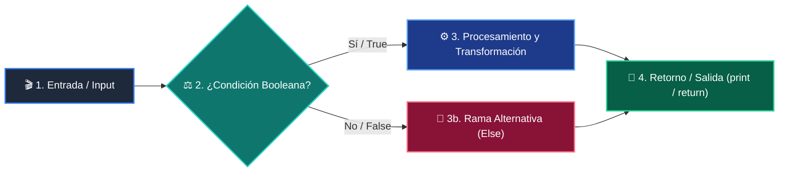

# 📚 Clase 01: Panorama General y Filosofía de Python

> **Programa:** Curso 1: Fundamentos Básicos de Python  
> **Nivel:** Nivel 1 - Principiante  
> **Metáfora Central:** *«Python como Lenguaje de Comunicación Humano-Máquina»*  
> **Documento Oficial PDF:** [clase-01-panorama-general.pdf](clase-01-panorama-general.pdf)  
> **Instructor:** **William Rodríguez (Wisrovi)** (AI Solutions Architect & Principal Software Engineer)  

---

## 👤 Perfil del Autor y Mentor

### **William Rodríguez (Wisrovi)**
*AI Solutions Architect & Principal Software Engineer &bull; Badajoz, España*

Ingeniero y arquitecto de software especializado en Inteligencia Artificial Generativa, sistemas multi-agente, Visión por Computador e infraestructuras MLOps de alta disponibilidad. Creador y mantenedor de la suite de software libre wisrovi SUITE en PyPI con más de 26 bibliotecas enfocadas en orquestación de pipelines, caching distribuido y optimización de bases de datos.

*   🐙 **GitHub:** [github.com/wisrovi](https://github.com/wisrovi)
*   💼 **LinkedIn:** [www.linkedin.com/in/wisrovi-rodriguez/](https://www.linkedin.com/in/wisrovi-rodriguez/)
*   🐳 **DockerHub:** [hub.docker.com/u/wisrovi](https://hub.docker.com/u/wisrovi)
*   🌐 **Website:** [wisrovi.dev](https://wisrovi.dev)
*   📦 **PyPI:** [pypi.org/user/wisrovi/](https://pypi.org/user/wisrovi/)

---

### 🚲 La Regla de la Bicicleta

> *"Nadie aprende a montar en bicicleta viendo tutoriales. El verdadero dominio de la programación surge cuando abres tu editor, escribes código con tus propias manos, resuelves errores y construyes proyectos reales."*

---

## 📑 Tabla de Contenidos de la Sesión

1. [💡 Fundamentación Teórica y Modelo Mental](#1--fundamentación-teórica-y-modelo-mental)
2. [🗺️ Arquitectura y Diagrama de Flujo](#2-️-arquitectura-y-diagrama-de-flujo)
3. [💻 Implementación en Python 3.10+](#3--implementación-en-python-310)
4. [🛡️ Buenas Prácticas y Trampas Frecuentes](#4-️-buenas-prácticas-y-trampas-frecuentes)
5. [🏋️ Desafío de Práctica](#5-️-desafío-de-práctica)
6. [📚 Bibliografía y Enlaces Canónicos](#6--bibliografía-y-enlaces-canónicos)

---

## 1. 💡 Fundamentación Teórica y Modelo Mental

Python es un lenguaje interpretado de alto nivel diseñado para maximizar la legibilidad y productividad del programador.

> [!NOTE]
> **🌟 Metáfora Didáctica:** Escribir en Python es como redactar instrucciones claras en un cuaderno que un asistente ejecuta al instante.

### Principios Fundamentales

El intérprete de Python lee el código de arriba a abajo, lo compila a bytecode y lo ejecuta en la máquina virtual (PVM).

El 'Zen de Python' (PEP 20) establece que lo explícito es mejor que lo implícito y la legibilidad es prioritaria.

> [!IMPORTANT]
> **⚡ Regla de Oro en Python:** La indentación define la jerarquía lógica del código en Python.

---

## 2. 🗺️ Arquitectura y Diagrama de Flujo

Flujo de lectura, compilación a bytecode en tiempo de ejecución y salida estándar.



### Desglose Paso a Paso del Flujo

| Fase | Acción del Intérprete | Estado en Memoria |
| :--- | :--- | :--- |
| **1. Inicialización** | Carga del archivo .py en memoria. | `Código fuente en buffer de texto.` |
| **2. Evaluación** | Generación de Bytecode (.pyc). | `Opcodes cargados en memoria.` |
| **3. Transformación** | Ejecución en la Máquina Virtual (PVM). | `Pila de evaluación activa.` |
| **4. Retorno / Salida** | Emisión a stdout (consola). | `Buffer vaciado tras imprimir.` |

> [!TIP]
> **🔍 Visualización Mental:** Imagina una cinta transportadora que valida cada línea antes de autorizar su ejecución.

---

## 3. 💻 Implementación en Python 3.10+

```python
# CLASE 01 - Código de Demostración
import sys

nombre = "Wisrovi Developer"
version = sys.version_info

print(f"Bienvenido {nombre} a Python {version.major}.{version.minor}")
print("Filosofía: Lo simple es mejor que lo complejo.")
```

*Uso del módulo estándar sys y formateo moderno con f-strings (PEP 498).*

---

## 4. 🛡️ Buenas Prácticas y Trampas Frecuentes

> [!WARNING]
> **⚠️ Gotcha Frecuente (Trampa de Principiante):** Mezclar espacios y tabulaciones genera un IndentationError silencioso.

*   **❌ Antipatrón:**
    ```python
def inicio():
	print('Tab')
    print('Espacios')  # ❌ IndentationError
    ```

*   **✅ Patrón Correcto:**
    ```python
def inicio():
    print('Consistente')
    print('4 espacios')  # ✅ PEP 8
    ```

> [!TIP]
> **💡 Consejo Profesional:** Configura VS Code con 'Editor: Insert Spaces' en true para evitar inconsistencias.

---

## 5. 🏋️ Desafío de Práctica

> **Desafío:** Crea un script que imprima tu nombre, tu meta de aprendizaje y valide que estás usando Python >= 3.10.

Para ejecutar la verificación automática con pytest:
```bash
pytest ejercicios/
```

---

## 6. 📚 Bibliografía y Enlaces Canónicos

| Fuente / Recurso | Descripción | Enlace |
| :--- | :--- | :--- |
| **Documentación Oficial de Python** | Especificación y biblioteca estándar | [docs.python.org/3/](https://docs.python.org/3/) |
| **PEP 8 — Style Guide for Python** | Estándar oficial de formateo y estilo | [peps.python.org/pep-0008/](https://peps.python.org/pep-0008/) |
| **Real Python Tutorials** | Patrones de ingeniería y desarrollo | [realpython.com](https://realpython.com/) |
| **Suite Open Source wisrovi** | Librerías de alto rendimiento | [github.com/wisrovi](https://github.com/wisrovi) |
