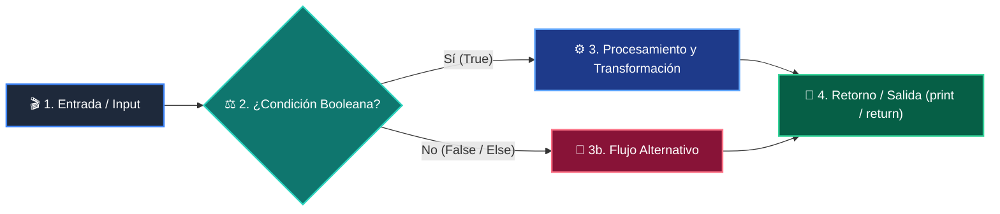

# 📖 Clase 01: El Panorama General de la Programación

> **Programa:** Curso 1: Fundamentos Básicos de Python (Nivel 1 (Principiantes))  
> **Nivel de Dificultad:** Principiante Absoluto  
> **Metáfora Central:** *«El Asistente, las Cajas, el Semáforo y la Licuadora»*  
> **Python Version:** 3.10+ | **Licencia:** MIT  

---

## 👤 Acerca del Autor y Mentor

### **William Rodríguez (Wisrovi)**
**AI Solutions Architect & Principal Software Engineer** &bull; *Badajoz, España*

Ingeniero y arquitecto de software especializado en Inteligencia Artificial Generativa, sistemas multi-agente, Visión por Computador e infraestructuras MLOps de alta disponibilidad. Creador y mantenedor de la suite de software libre <strong>wisrovi SUITE</strong> en PyPI con más de 26 bibliotecas enfocadas en orquestación de pipelines, caching distribuido y optimización de bases de datos.

*   🐙 **GitHub:** [github.com/wisrovi](https://github.com/wisrovi)
*   💼 **LinkedIn:** [www.linkedin.com/in/wisrovi-rodriguez/](https://www.linkedin.com/in/wisrovi-rodriguez/)
*   🐳 **DockerHub:** [hub.docker.com/u/wisrovi](https://hub.docker.com/u/wisrovi)
*   🌐 **Website:** [wisrovi.dev](https://wisrovi.dev)
*   📦 **PyPI:** [pypi.org/user/wisrovi/](https://pypi.org/user/wisrovi/)

---

### 🚲 Metodología de Aprendizaje: La Regla de la Bicicleta

> *"Nadie aprende a montar en bicicleta viendo tutoriales. El verdadero dominio de la programación surge cuando abres tu editor, escribes código con tus propias manos, resuelves errores y construyes proyectos reales."*

> [!TIP]
> **El Compromiso Activo del Estudiante:** Abre Visual Studio Code en cada sesión. Escribe cada ejemplo con tus propias manos. Cambia los números, rompe el código deliberadamente para ver el mensaje de error de Python, y luego arréglalo.

---

## 📑 Tabla de Contenidos

| Capítulo | Tema | Enfoque Principal |
| :--- | :--- | :--- |
| **01** | **Fundamentos & Metáfora** | Los Cuatro Pilares Fundamentales del Software |
| **02** | **Arquitectura de Flujo** | Diagrama de Ejecución Secuencial y Control |
| **03** | **Implementación Práctica** | Script Integrador de los 4 Pilares |
| **04** | **Patrones & Debugging** | Buenas Prácticas, Gotchas y Depuración |
| **05** | **Conclusiones & Cierre** | Resumen ejecutivo, notas del mentor y agradecimiento |
| **06** | **Bibliografía & Recursos** | Fuentes oficiales y retos de autoestudio |

### 🎯 Objetivos de Aprendizaje

*   **Competencia Conceptual:** Comprender que programar es dar instrucciones secuenciales precisas y dominar la función mental de los 4 pilares.
*   **Competencia Práctica:** Ejecutar tu primer script en VS Code usando print(), variables, condicionales if y funciones def.

---

## 1. 💡 Los Cuatro Pilares Fundamentales del Software

Toda aplicación moderna, desde un script de automatización hasta una Inteligencia Artificial, está construida sobre cuatro bloques lógicos elementales.

> [!NOTE]
> ### 🌟 Metáfora Central: El Asistente, las Cajas, el Semáforo y la Licuadora
> Imagina que la computadora es un asistente súper eficiente pero literal: las variables son cajas etiquetadas donde guarda cosas, el if es un semáforo que decide el camino según la luz, el for es una cinta transportadora que procesa elementos uno a uno, y la función def es una licuadora que recibe ingredientes y entrega un licuado.

### Principios Teóricos y Modelo Mental

1. Variables (Memoria): Espacios con nombre para retener datos temporalmente. 2. Condicionales (Decisión): Bifurcaciones lógicas según condiciones booleanas. 3. Bucles (Repetición): Automatización de tareas repetitivas sin duplicar código. 4. Funciones (Modularidad): Bloques reutilizables con entradas y salidas bien definidas.

La magia del software no radica en la complejidad de cada pieza aislada, sino en la sinergia con la que se combinan para modelar la realidad.

> [!IMPORTANT]
> ### ⚡ Regla de Oro en Python
> Python es un lenguaje interpretado, de tipado dinámico y fuertemente tipado: respeta la indentación y la semántica.

---

## 2. 🗺️ Diagrama de Ejecución Secuencial y Control

Cómo el intérprete de Python procesa el código línea por línea desde el punto de entrada hasta la resolución.

### Diagrama Visual del Flujo



### Desglose Paso a Paso del Flujo

| Fase del Flujo | Acción del Intérprete | Estado en Memoria |
| :--- | :--- | :--- |
| **1. Inicialización** | Lee la instrucción inicial e inicializa el entorno de variables en memoria. | `Tabla de símbolos vacía -> asigna valores` |
| **2. Evaluación** | Evalúa expresiones booleanas en condicionales para determinar la ruta. | `Evalúa True o False en CPU` |
| **3. Transformación** | Ejecuta el bloque indentado correspondiente a la condición satisfecha. | `Transformación de variables` |
| **4. Retorno / Salida** | Invoca funciones y devuelve el resultado a la consola con print(). | `Liberación de stack frame` |

> [!TIP]
> **Visualización Mental:** Piensa en el intérprete de Python como un lector con un marcador que avanza de arriba a abajo, saltando sólo cuando encuentra estructuras de control.

---

## 3. 💻 Script Integrador de los 4 Pilares

Código autónomo que demuestra la interacción armónica entre variables, condicionales, bucles y funciones:

```python
# main.py - Python 3.10+ PEP 8 Compliant
# 1. Definición de Función Reutilizable (La Licuadora)
def evaluar_estudiante(nombre: str, nota: float) -> str:
    if nota >= 7.0:
        return f"¡Felicidades {nombre}! Aprobaste con éxito 🚀"
    else:
        return f"Ánimo {nombre}, debes reforzar los conceptos 📚"

# 2. Variables y Colección (Cajas en memoria)
estudiantes = ["Ana", "Carlos", "Sofía"]
calificaciones = [9.5, 5.8, 8.2]

# 3. Bucle de Procesamiento (Cinta Transportadora)
for i in range(len(estudiantes)):
    resultado = evaluar_estudiante(estudiantes[i], calificaciones[i])
    print(resultado)
```

### Análisis del Código Fuente

El código define una función pura con type hints, itera una colección de datos mediante un bucle for y delega la toma de decisiones al condicional interno.

---

## 4. 🛡️ Buenas Prácticas, Gotchas y Depuración

Consejos clave para evitar los errores más comunes al dar tus primeros pasos en Python:

> [!WARNING]
> ### ⚠️ Gotcha Frecuente (Trampa de Principiante)
> Olvidar los dos puntos (:) al final de las estructuras if, for o def, o mezclar espacios y tabulaciones en la indentación.

### Comparativa: Antipatrón vs Patrón Recomendado

#### ❌ Antipatrón / Mal Código:
```python
if nota > 5
print("Aprobado") # Error de sintaxis
```

#### ✅ Patrón Pythonic / Correcto:
```python
if nota > 5:
    print("Aprobado") # Correcto e indentado
```

> [!TIP]
> **Consejo de Resiliencia en Producción:** Configura VS Code para insertar 4 espacios automáticos al presionar la tecla Tab y activa el formateador black o ruff.

---

## 5. 🏆 Conclusiones y Resumen Ejecutivo

Has adquirido el mapa completo del territorio de la programación. Ya conoces los 4 pilares y cómo se coordinan.

> [!NOTE]
> ### 🎖️ Logro Alcanzado
> Primer script integrador ejecutado con éxito y comprensión clara del flujo lógico.

### 📝 Notas del Instructor
En la próxima sesión profundizaremos en el Almacén de Datos: tipos primitivos, conversión de tipos e interacción con el usuario mediante input().

### 🤝 Mensaje de Agradecimiento
Muchas gracias por tu entusiasmo, disciplina y dedicación al participar en este programa formativo. La programación es un superpoder que transforma vidas cuando se ejerce con constancia y curiosidad. ¡Nos vemos en la próxima sesión para seguir construyendo juntos! 💻🚀

---

## 6. 📚 Bibliografía y Fuentes de Estudio

| Fuente / Recurso | Descripción Temática | Enlace Oficial |
| :--- | :--- | :--- |
| **Documentación Oficial de Python** | Referencia canónica del lenguaje y librería estándar | [docs.python.org/3/](https://docs.python.org/3/) |
| **PEP 8 — Style Guide for Python** | Guía oficial de estilo, formato e indentación | [peps.python.org/pep-0008/](https://peps.python.org/pep-0008/) |
| **Real Python Tutorials** | Artículos técnicos y patrones de desarrollo moderno | [realpython.com](https://realpython.com/) |
| **Python Type Checking (PEP 484)** | Anotaciones de tipo y análisis estático | [docs.python.org/typing](https://docs.python.org/3/library/typing.html) |
| **Suite Open Source wisrovi** | Paquetes Python para orquestación y rendimiento | [github.com/wisrovi](https://github.com/wisrovi) |

> [!TIP]
> ### 🏋️ Desafío de Autoestudio Recomendado
> Modifica el script de la página 6 para que evalúe a 5 alumnos y clasifique notas con honores (mayores a 9.0).
