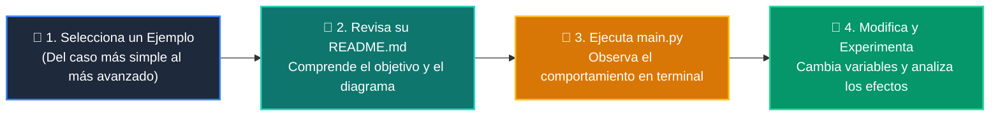

# 💻 Catálogo de Ejemplos Prácticos: Clase 01: Primer Vistazo Práctico (print, variables, if, for)

> **Ubicación:** `curso/clase-01-panorama-general/ejemplos`  
> **Filosofía:** *Aprender programando mediante casos de uso aislados, legibles y comentados.*

---

## 🗺️ Flujo de Estudio Recomendado



---

## 📑 Ejemplos Disponibles en esta Clase

| Directorio | Caso de Uso Demostrado | Script Principal |
| :--- | :--- | :---: |
| [`ejemplo_01_print_y_mensajes/`](ejemplo_01_print_y_mensajes/) | 01 Print Y Mensajes | [`main.py`](ejemplo_01_print_y_mensajes/main.py) |
| [`ejemplo_02_variables_cajas_etiquetadas/`](ejemplo_02_variables_cajas_etiquetadas/) | 02 Variables Cajas Etiquetadas | [`main.py`](ejemplo_02_variables_cajas_etiquetadas/main.py) |
| [`ejemplo_03_if_el_semaforo_de_decisiones/`](ejemplo_03_if_el_semaforo_de_decisiones/) | 03 If El Semaforo De Decisiones | [`main.py`](ejemplo_03_if_el_semaforo_de_decisiones/main.py) |
| [`ejemplo_04_for_la_cinta_transportadora/`](ejemplo_04_for_la_cinta_transportadora/) | 04 For La Cinta Transportadora | [`main.py`](ejemplo_04_for_la_cinta_transportadora/main.py) |
| [`ejemplo_05_funcion_la_licuadora/`](ejemplo_05_funcion_la_licuadora/) | 05 Funcion La Licuadora | [`main.py`](ejemplo_05_funcion_la_licuadora/main.py) |


---

## 🚀 Cómo Ejecutar Cualquier Ejemplo
Abre tu terminal en la raíz del repositorio y ejecuta:
```bash
python 01-fundamentos-python/clase-01-panorama-general/ejemplos/<nombre_del_ejemplo>/main.py
```
