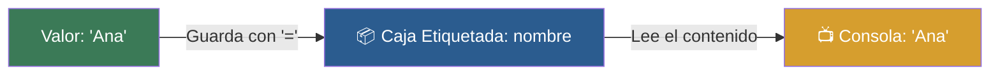

# 📑 Ejemplo 02: Las Cajas Etiquetadas (Variables)

> **Concepto Clave:** Creación, asignación y uso de variables (=).  
> **Metáfora:** Cajas de Mudanza: Guardas un objeto dentro de una caja y le pegas una etiqueta para encontrarlo después.

---

## 📊 Diagrama de Flujo del Ejemplo



---

## 🏃‍♂️ ¿Cómo ejecutar este ejemplo?

Abre tu terminal en VS Code y ejecuta:

```bash
python 01-fundamentos-python/clase-01-panorama-general/ejemplos/ejemplo-02-variables-cajas-etiquetadas/02_variables_cajas_etiquetadas.py
```

---

## 📄 Explicación Paso a Paso

1. Lee detenidamente los comentarios dentro del archivo [`02_variables_cajas_etiquetadas.py`](02_variables_cajas_etiquetadas.py).
2. Ejecuta el código y observa la salida en consola.
3. Revisa la sección final del archivo para ver el resumen conceptual explicativo.
