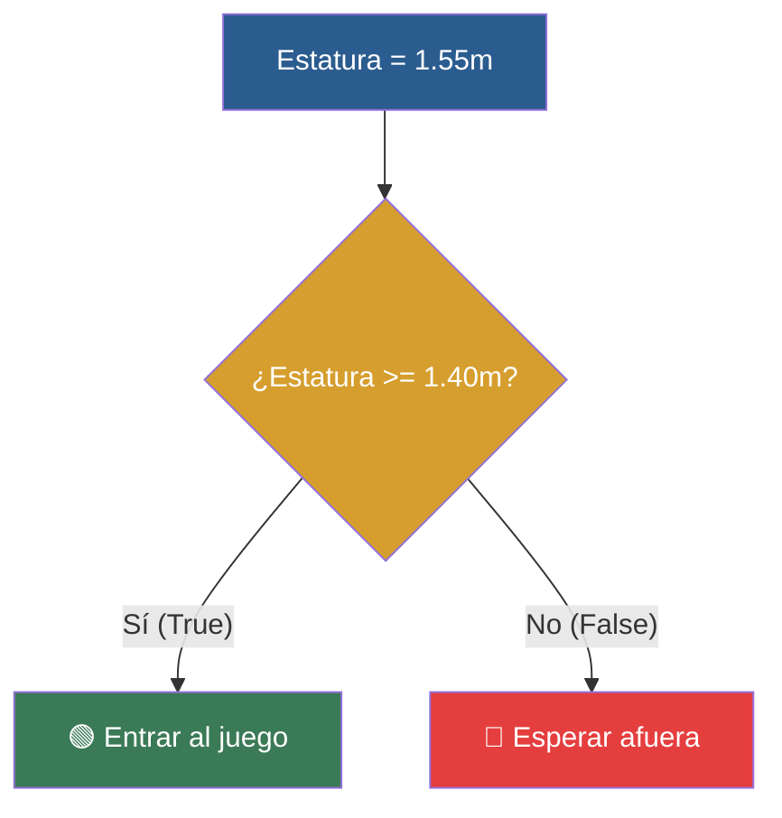

# 📑 Ejemplo 03: El Semáforo de Decisiones (Condicional if)

> **Concepto Clave:** Toma de decisiones mediante 'if' y 'else'.  
> **Metáfora:** El Guardia de Puerta: Si cumples la condición (altura >= 1.40), entras; si no, te quedas fuera.

---

## 📊 Diagrama de Flujo del Ejemplo



---

## 🏃‍♂️ ¿Cómo ejecutar este ejemplo?

Abre tu terminal en VS Code y ejecuta:

```bash
python 01-fundamentos-python/clase-01-panorama-general/ejemplos/ejemplo-03-if-el-semaforo-de-decisiones/03_if_el_semaforo_de_decisiones.py
```

---

## 📄 Explicación Paso a Paso

1. Lee detenidamente los comentarios dentro del archivo [`03_if_el_semaforo_de_decisiones.py`](03_if_el_semaforo_de_decisiones.py).
2. Ejecuta el código y observa la salida en consola.
3. Revisa la sección final del archivo para ver el resumen conceptual explicativo.
