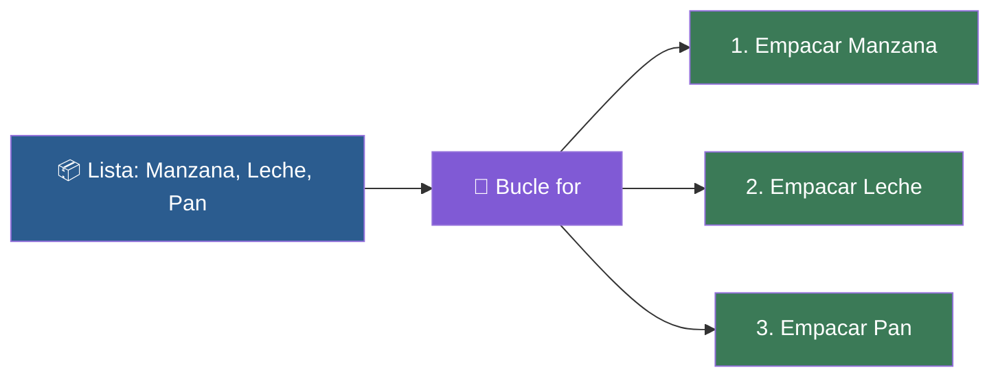

# 📑 Ejemplo 04: La Cinta Transportadora (Bucle for)

> **Concepto Clave:** Recorrer colecciones de elementos secuencialmente con 'for'.  
> **Metáfora:** Cinta Transportadora de Empaque: Cada caja que pasa por la cinta recibe una acción automáticamente.

---

## 📊 Diagrama de Flujo del Ejemplo



---

## 🏃‍♂️ ¿Cómo ejecutar este ejemplo?

Abre tu terminal en VS Code y ejecuta:

```bash
python 01-fundamentos-python/clase-01-panorama-general/ejemplos/ejemplo-04-for-la-cinta-transportadora/04_for_la_cinta_transportadora.py
```

---

## 📄 Explicación Paso a Paso

1. Lee detenidamente los comentarios dentro del archivo [`04_for_la_cinta_transportadora.py`](04_for_la_cinta_transportadora.py).
2. Ejecuta el código y observa la salida en consola.
3. Revisa la sección final del archivo para ver el resumen conceptual explicativo.
