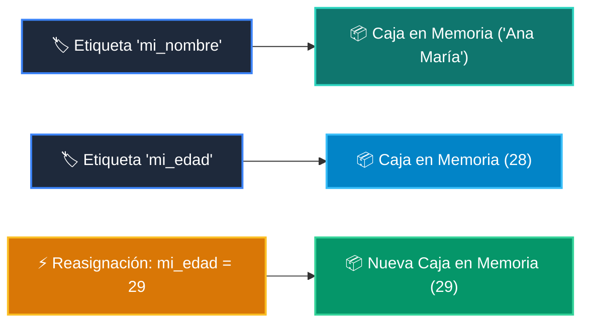

# 📖 02 Variables Cajas Etiquetadas

<div align="center">

**Clase:** Clase 01: Primer Vistazo Práctico (print, variables, if, for)  
*Script de Ejecución:* [`main.py`](main.py)

</div>

---

## 🎯 Propósito del Ejemplo
Ejemplo 02: Las Cajas Etiquetadas (Variables).

---

## 🗺️ Diagrama de Flujo del Script



---

## 🔍 Aspectos Clave a Observar en el Código

1. **Claridad Sintáctica:** Estructura modular, tipado explícito y apego a la guía de estilo oficial PEP 8.
2. **Transformación de Datos:** Cómo se declaran las entradas, se procesan en memoria y se devuelven al usuario.
3. **Robustez:** Prevención de comportamientos inesperados mediante nombres expresivos y control lógico.

---

## 💻 Ejecución desde la Terminal

Desde la raíz del proyecto, ejecuta:

```bash
python 01-fundamentos-python/clase-01-panorama-general/ejemplos/ejemplo_02_variables_cajas_etiquetadas/main.py
```
