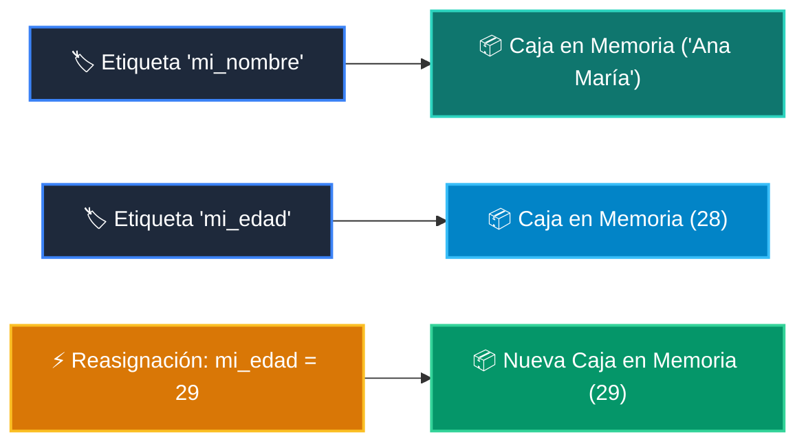

# 📖 02 Variables Cajas Etiquetadas

> **Clase:** Clase 01: Primer Vistazo Práctico (print, variables, if, for)  
> **Archivo de Código:** [`main.py`](main.py)  

Demostración práctica y ejecutable de este concepto fundamental de Python.

---

## 🗺️ Flujo de Ejecución del Ejemplo



---

## 💻 Ejecución desde Terminal
```bash
python 01-fundamentos-python/clase-01-panorama-general/ejemplos/ejemplo_02_variables_cajas_etiquetadas/main.py
```
