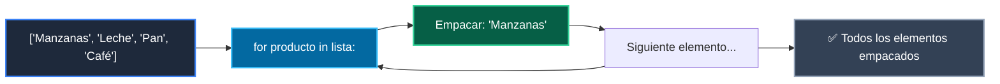

# 📖 04 For La Cinta Transportadora

> **Clase:** Clase 01: Primer Vistazo Práctico (print, variables, if, for)  
> **Script:** [`main.py`](main.py)  

Ejemplo 04: La Cinta Transportadora (Bucle for).

---

## 🗺️ Flujo de Ejecución del Ejemplo



---

## 💻 Ejecución desde Terminal

```bash
python 01-fundamentos-python/clase-01-panorama-general/ejemplos/ejemplo_04_for_la_cinta_transportadora/main.py
```
