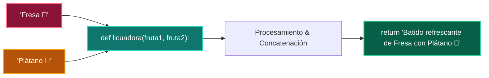

# 📖 05 Funcion La Licuadora

> **Clase:** Clase 01: Primer Vistazo Práctico (print, variables, if, for)  
> **Script:** [`main.py`](main.py)  

Ejemplo 05: La Licuadora (Funciones con def).

---

## 🗺️ Flujo de Ejecución del Ejemplo



---

## 💻 Ejecución desde Terminal

```bash
python 01-fundamentos-python/clase-01-panorama-general/ejemplos/ejemplo_05_funcion_la_licuadora/main.py
```
