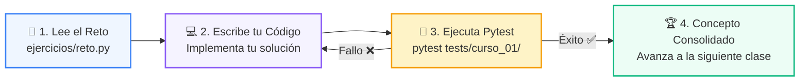

# 🏋️ Reto Práctico: Clase 01: Primer Vistazo Práctico (print, variables, if, for)

> **Curso:** 01-fundamentos-python &bull; **Semana:** CLASE 01  
> **Ubicación:** `01-fundamentos-python/clase-01-panorama-general/ejercicios`  

---

## 🌀 Ciclo de Resolución y Validación



---

## 🎯 Desafío de la Sesión
> **Enunciado:** Crea un script que defina una lista de 3 alumnos con sus notas, use un for para recorrerlos y un if/else para imprimir si cada uno aprobó (nota >= 60) o reprobó.

---

## 🚀 Pasos para Resolverlo
1. Abre el archivo [`reto.py`](reto.py).
2. Escribe tu lógica de solución.
3. Valida tus resultados ejecutando las pruebas unitarias:
   ```bash
   pytest tests/curso_01/
   ```
