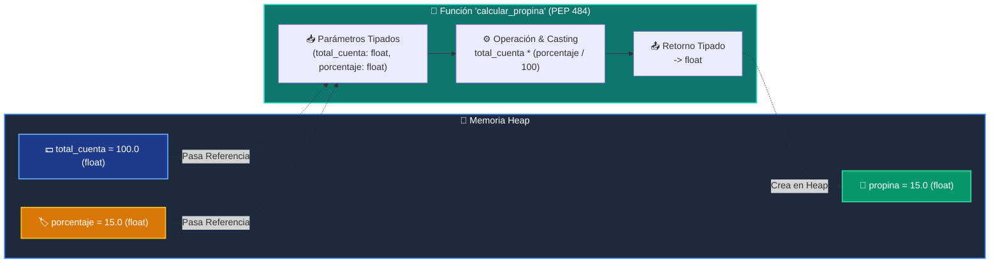

# 📘 Clase 02: Variables, Tipos de Datos y Funciones con Type Hints

<div align="center">

**Curso 1: Fundamentos Básicos de Python** &bull; **Semana CLASE 02**  
*Nivel:* `Nivel 1 - Principiante` &bull; *Metáfora Central:* **«Variables como Cajas Etiquetadas en Memoria y la Licuadora Tipada (PEP 484)»**

[](https://colab.research.google.com/github/wisrovi/wisrovi-python/blob/main/01-fundamentos-python/clase-02-variables-y-tipos/notebook/clase-02-variables-y-tipos.ipynb)
[](clase-02-variables-y-tipos.pdf)
[](book.md)

</div>

---

## 🎯 Objetivos de Aprendizaje de la Sesión

*   **Competencia Conceptual:** Comprender el modelo mental de *«Variables como Cajas Etiquetadas en Memoria»* y cómo se transmiten referencias de objetos a funciones (`def`).
*   **Competencia Práctica:** Escribir, ejecutar y depurar funciones en Python aplicando *Type Hints* (PEP 484), *casting* explícito y formateo con f-strings.
*   **Competencia de Ingeniería:** Resolver el reto de la calculadora modular y verificar su correcto funcionamiento con la suite de pruebas automatizadas (`pytest`).

---

## 🗺️ Mapa de Arquitectura y Flujo de Ejecución



---

## 📂 Organización de Materiales en esta Clase

```text
clase-02-variables-y-tipos/
├── 📄 clase-02-variables-y-tipos.pdf       # Manual técnico oficial de estudio (9 páginas)
├── 📖 book.md                     # Libro digital interactivo con diagramas Mermaid
├── 📝 README.md                   # Esta guía general de la clase
├── 📁 notebook/                   # Cuaderno Jupyter interactivo
│   ├── 📓 clase-02-variables-y-tipos.ipynb
│   └── 📝 README.md               # Guía con badge a Google Colab
├── 📁 ejemplos/                   # Carpetas de código estructurado paso a paso
│   └── 📝 README.md               # Catálogo de 6 ejemplos modulares con funciones
└── 📁 ejercicios/                 # Reto práctico para el estudiante
    ├── 🐍 reto.py                 # Enunciado y funciones modulares a implementar
    ├── 🐍 ejercicio_02_perfil_usuario.py # Ejercicio guiado de perfil de usuario
    └── 📝 README.md               # Instrucciones de resolución y comandos pytest
```

---

## 🏋️ Desafío Práctico de la Sesión
> **Enunciado:** Construye una calculadora de propinas y facturación modular implementando `calcular_propina`, `calcular_total_por_persona` y `formatear_factura` con tipado PEP 484.

Abre el archivo [`ejercicios/reto.py`](ejercicios/reto.py), completa tu implementación y valida tu código ejecutando:
```bash
pytest tests/curso_01/test_clase_02.py
```

