```mermaid
flowchart LR
    INPUT["📥 Entrada del Usuario<br/>'45.90' (str)"] --> CAST1["⚙️ float('45.90')<br/>Conversión Decimal"]
    CAST1 --> FLOAT_VAL["💵 45.90 (float)<br/>Número Flotante"]
    FLOAT_VAL --> CAST2["⚙️ int(45.90)<br/>Truncado a Entero"]
    CAST2 --> INT_VAL["🔢 45 (int)<br/>Número Entero"]
    INT_VAL --> MEM["🧠 Memoria Heap<br/>id(objeto) & Inmutabilidad"]

    style INPUT fill:#1e293b,color:#ffffff,stroke:#3b82f6,stroke-width:2px
    style CAST1 fill:#d97706,color:#ffffff,stroke:#fbbf24,stroke-width:2px
    style FLOAT_VAL fill:#0f766e,color:#ffffff,stroke:#2dd4bf,stroke-width:2px
    style CAST2 fill:#d97706,color:#ffffff,stroke:#fbbf24,stroke-width:2px
    style INT_VAL fill:#059669,color:#ffffff,stroke:#34d399,stroke-width:2px
    style MEM fill:#4338ca,color:#ffffff,stroke:#818cf8,stroke-width:2px
```

# 📘 Clase 02: Variables, Tipos de Datos y Operadores

<div align="center">

**Curso 1: Fundamentos Básicos de Python** &bull; **Semana CLASE 02**  
*Nivel:* `Nivel 1 - Principiante` &bull; *Metáfora Central:* **«Variables como Cajas Etiquetadas en Memoria»**

[](https://colab.research.google.com/github/wisrovi/wisrovi-python/blob/main/01-fundamentos-python/clase-02-variables-y-tipos/notebook/clase-02-variables-y-tipos.ipynb)
[](clase-02-variables-y-tipos.pdf)
[](book.md)

</div>

---

## 🎯 Objetivos de Aprendizaje de la Sesión

*   **Competencia Conceptual:** Comprender el modelo mental de *«Variables como Cajas Etiquetadas en Memoria»* (Una variable es una etiqueta adhesiva pegada a una caja; varias etiquetas pueden apuntar a la misma caja.).
*   **Competencia Práctica:** Escribir, ejecutar y depurar scripts en Python aplicando buenas prácticas (PEP 8) y tipado.
*   **Competencia de Ingeniería:** Resolver el reto práctico de la sesión y verificar su correcto funcionamiento con la suite de pruebas automatizadas.

---

## 🗺️ Mapa de Arquitectura y Flujo de Ejecución



---

## 📂 Organización de Materiales en esta Clase

```text
clase-02-variables-y-tipos/
├── 📄 clase-02-variables-y-tipos.pdf       # Manual técnico oficial de estudio (9 páginas)
├── 📖 book.md                     # Libro digital interactivo con diagramas Mermaid
├── 📝 README.md                   # Esta guía general de la clase
├── 📁 notebook/                   # Cuaderno Jupyter interactivo
│   ├── 📓 clase-02-variables-y-tipos.ipynb
│   └── 📝 README.md               # Guía con badge a Google Colab
├── 📁 ejemplos/                   # Carpetas de código estructurado paso a paso
│   └── 📝 README.md               # Catálogo de ejemplos con comandos de ejecución
└── 📁 ejercicios/                 # Reto práctico para el estudiante
    ├── 🐍 reto.py                 # Enunciado y plantilla del ejercicio
    └── 📝 README.md               # Instrucciones de resolución y comandos pytest
```

---

## 🏋️ Desafío Práctico de la Sesión
> **Enunciado:** Crea una calculadora de propinas que solicite el total de la cuenta y el porcentaje deseado.

Abre el archivo [`ejercicios/reto.py`](ejercicios/reto.py), completa tu implementación y valida tu código ejecutando:
```bash
pytest tests/curso_01/test_clase_02_variables_y_tipos.py
```
