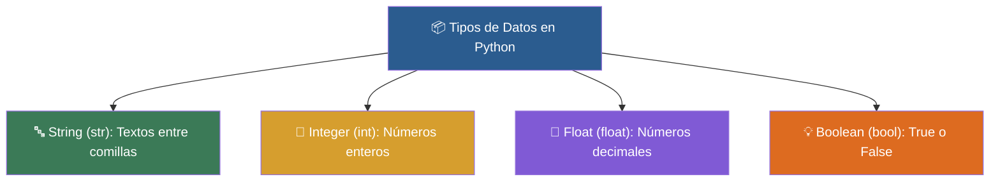

# 📦 Clase 02: Variables y Tipos de Datos - El Almacén de Información

> **Objetivo:** Aprender los 4 tipos de datos fundamentales (str, int, float, bool) y la interacción con teclado (input).

---

## 💡 Diagrama Conceptual de la Clase

---

## 📚 Ejemplos Prácticos de la Clase

| Ejemplo | Concepto Principal | Metáfora del Mundo Real | Enlace al Material |
| :--- | :--- | :--- | :---: |
| **Ejemplo 01** | Manipulación de textos (str), concatenación y f-strings. | *Collar de Perlas* | [📁 Ver Ejemplo](ejemplos/ejemplo-01-strings-collar-de-letras/) |
| **Ejemplo 02** | Diferencia entre enteros (int) y números decimales (float). | *Monedas vs Báscula* | [📁 Ver Ejemplo](ejemplos/ejemplo-02-numeros-enteros-y-decimales/) |
| **Ejemplo 03** | Uso de valores de verdad (True / False) y comparaciones. | *Interruptor de luz* | [📁 Ver Ejemplo](ejemplos/ejemplo-03-booleanos-los-interruptores/) |
| **Ejemplo 04** | Transformación entre str, int y float mediante int(), str(), float(). | *Adaptador de enchufe de viaje* | [📁 Ver Ejemplo](ejemplos/ejemplo-04-conversion-tipos-los-adaptadores/) |
| **Ejemplo 05** | Solicitar datos al usuario mediante input() y procesarlos. | *El Micrófono* | [📁 Ver Ejemplo](ejemplos/ejemplo-05-input-el-microfono/) |

---

## 🏋️ Ejercicio Práctico de la Clase

Revisa la carpeta de [ejercicios/](ejercicios/) para aplicar los conocimientos adquiridos.
