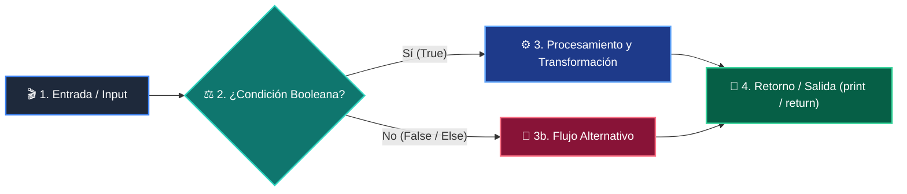

# 📖 Clase 02: Variables y Tipos de Datos

> **Programa:** Curso 1: Fundamentos Básicos de Python (Nivel 1 (Principiantes))  
> **Nivel de Dificultad:** Principiante Absoluto  
> **Metáfora Central:** *«El Almacén, el Collar de Letras y el Micrófono»*  
> **Python Version:** 3.10+ | **Licencia:** MIT  

---

## 👤 Acerca del Autor y Mentor

### **William Rodríguez (Wisrovi)**
**AI Solutions Architect & Principal Software Engineer** &bull; *Badajoz, España*

Ingeniero y arquitecto de software especializado en Inteligencia Artificial Generativa, sistemas multi-agente, Visión por Computador e infraestructuras MLOps de alta disponibilidad. Creador y mantenedor de la suite de software libre <strong>wisrovi SUITE</strong> en PyPI con más de 26 bibliotecas enfocadas en orquestación de pipelines, caching distribuido y optimización de bases de datos.

*   🐙 **GitHub:** [github.com/wisrovi](https://github.com/wisrovi)
*   💼 **LinkedIn:** [www.linkedin.com/in/wisrovi-rodriguez/](https://www.linkedin.com/in/wisrovi-rodriguez/)
*   🐳 **DockerHub:** [hub.docker.com/u/wisrovi](https://hub.docker.com/u/wisrovi)
*   🌐 **Website:** [wisrovi.dev](https://wisrovi.dev)
*   📦 **PyPI:** [pypi.org/user/wisrovi/](https://pypi.org/user/wisrovi/)

---

### 🚲 Metodología de Aprendizaje: La Regla de la Bicicleta

> *"Nadie aprende a montar en bicicleta viendo tutoriales. El verdadero dominio de la programación surge cuando abres tu editor, escribes código con tus propias manos, resuelves errores y construyes proyectos reales."*

> [!TIP]
> **El Compromiso Activo del Estudiante:** Abre Visual Studio Code en cada sesión. Escribe cada ejemplo con tus propias manos. Cambia los números, rompe el código deliberadamente para ver el mensaje de error de Python, y luego arréglalo.

---

## 📑 Tabla de Contenidos

| Capítulo | Tema | Enfoque Principal |
| :--- | :--- | :--- |
| **01** | **Fundamentos & Metáfora** | El Almacén de Datos y la Memoria de la Computadora |
| **02** | **Arquitectura de Flujo** | Ciclo de Conversión y Entrada de Datos (Casting) |
| **03** | **Implementación Práctica** | Calculadora de Ahorro con Conversión de Tipos |
| **04** | **Patrones & Debugging** | Trampas Clásicas con Variables y Casting |
| **05** | **Conclusiones & Cierre** | Resumen ejecutivo, notas del mentor y agradecimiento |
| **06** | **Bibliografía & Recursos** | Fuentes oficiales y retos de autoestudio |

### 🎯 Objetivos de Aprendizaje

*   **Competencia Conceptual:** Comprender la diferencia fundamental entre tipos numéricos y texto, y cómo Python asigna memoria dinámicamente.
*   **Competencia Práctica:** Construir programas interactivos que soliciten datos al usuario, realicen conversiones numéricas y devuelvan mensajes formateados.

---

## 1. 💡 El Almacén de Datos y la Memoria de la Computadora

Una variable es un identificador que apunta a una ubicación de memoria donde reside un valor con un tipo de dato específico.

> [!NOTE]
> ### 🌟 Metáfora Central: El Almacén, el Collar de Letras y el Micrófono
> Imagina un almacén con cajas etiquetadas. Una caja pequeña guarda números enteros (int), una caja de precisión con decimales guarda números reales (float), una caja larga guarda un collar de letras enhebradas (str) y un interruptor de encendido/apagado representa un valor booleano (bool).

### Principios Teóricos y Modelo Mental

Python utiliza tipado dinámico: no necesitas declarar el tipo de antemano, el intérprete lo infiere en tiempo de asignación.

La función input() SIEMPRE devuelve una cadena de texto (str). Para operar matemáticamente con ella es imperativo hacer casting mediante int() o float().

> [!IMPORTANT]
> ### ⚡ Regla de Oro en Python
> Nunca sumes texto con números sin convertir; '10' + 5 genera TypeError, pero int('10') + 5 produce 15.

---

## 2. 🗺️ Ciclo de Conversión y Entrada de Datos (Casting)

Flujo de recepción de datos por teclado, validación de tipo y operación aritmética en memoria.

### Diagrama Visual del Flujo



### Desglose Paso a Paso del Flujo

| Fase del Flujo | Acción del Intérprete | Estado en Memoria |
| :--- | :--- | :--- |
| **1. Inicialización** | La función input() captura la entrada del teclado como string. | `Buffer de entrada -> '25' (str)` |
| **2. Evaluación** | La función int() o float() transforma los caracteres en número binario. | `Casting -> 25 (int)` |
| **3. Transformación** | La ALU del procesador realiza la operación matemática solicitada. | `25 * 2 = 50 en CPU` |
| **4. Retorno / Salida** | f-string formatea el resultado y lo proyecta en la salida estándar. | `Render en pantalla` |

> [!TIP]
> **Visualización Mental:** Siempre valida y castea los datos en la frontera de entrada del programa antes de procesarlos en la lógica de negocio.

---

## 3. 💻 Calculadora de Ahorro con Conversión de Tipos

Programa completo que solicita entradas, convierte tipos de datos y utiliza f-strings modernas:

```python
# main.py - Python 3.10+ PEP 8 Compliant
# Entrada de datos con conversión directa
nombre_usuario: str = input("Ingresa tu nombre: ")
ingreso_mensual: float = float(input("Ingreso mensual ($): "))
porcentaje_ahorro: float = float(input("Porcentaje a ahorrar (%): "))

# Cálculo matemático
monto_ahorro: float = ingreso_mensual * (porcentaje_ahorro / 100.0)
es_meta_alta: bool = monto_ahorro >= 500.0

# Salida formateada con f-strings
print(f"
--- Reporte Financiero de {nombre_usuario} ---")
print(f"Ahorro estimado: ${monto_ahorro:,.2f}")
print(f"¿Es un ahorro significativo?: {es_meta_alta}")
```

### Análisis del Código Fuente

Se declaran variables con anotaciones de tipo, se realiza casting explícito con float() y se formatea el número a dos decimales con ${monto_ahorro:,.2f}.

---

## 4. 🛡️ Trampas Clásicas con Variables y Casting

Errores comunes de principiantes al trabajar con tipos de datos:

> [!WARNING]
> ### ⚠️ Gotcha Frecuente (Trampa de Principiante)
> Intentar convertir una cadena con caracteres alfabéticos a int (ej: int('hola')), lo cual dispara un ValueError.

### Comparativa: Antipatrón vs Patrón Recomendado

#### ❌ Antipatrón / Mal Código:
```python
edad = input('Edad: ')
total = edad + 5 # TypeError: str + int
```

#### ✅ Patrón Pythonic / Correcto:
```python
edad = int(input('Edad: '))
total = edad + 5 # Correcto: suma entera
```

> [!TIP]
> **Consejo de Resiliencia en Producción:** Usa siempre f-strings (f'Texto {variable}') en lugar del operador + para concatenar texto con variables.

---

## 5. 🏆 Conclusiones y Resumen Ejecutivo

Dominas los 4 tipos primitivos esenciales de Python, la captura interactiva de datos y el formateo profesional.

> [!NOTE]
> ### 🎖️ Logro Alcanzado
> Capacidad para construir programas interactivos con entradas validadas y cálculos matemáticos precisos.

### 📝 Notas del Instructor
En la siguiente clase exploraremos el control de flujo condicional: cómo dotar a la computadora de capacidad de decisión.

### 🤝 Mensaje de Agradecimiento
Muchas gracias por tu entusiasmo, disciplina y dedicación al participar en este programa formativo. La programación es un superpoder que transforma vidas cuando se ejerce con constancia y curiosidad. ¡Nos vemos en la próxima sesión para seguir construyendo juntos! 💻🚀

---

## 6. 📚 Bibliografía y Fuentes de Estudio

| Fuente / Recurso | Descripción Temática | Enlace Oficial |
| :--- | :--- | :--- |
| **Documentación Oficial de Python** | Referencia canónica del lenguaje y librería estándar | [docs.python.org/3/](https://docs.python.org/3/) |
| **PEP 8 — Style Guide for Python** | Guía oficial de estilo, formato e indentación | [peps.python.org/pep-0008/](https://peps.python.org/pep-0008/) |
| **Real Python Tutorials** | Artículos técnicos y patrones de desarrollo moderno | [realpython.com](https://realpython.com/) |
| **Python Type Checking (PEP 484)** | Anotaciones de tipo y análisis estático | [docs.python.org/typing](https://docs.python.org/3/library/typing.html) |
| **Suite Open Source wisrovi** | Paquetes Python para orquestación y rendimiento | [github.com/wisrovi](https://github.com/wisrovi) |

> [!TIP]
> ### 🏋️ Desafío de Autoestudio Recomendado
> Crea un conversor de temperatura que solicite grados Celsius y devuelva Fahrenheit y Kelvin formateados a un decimal.
