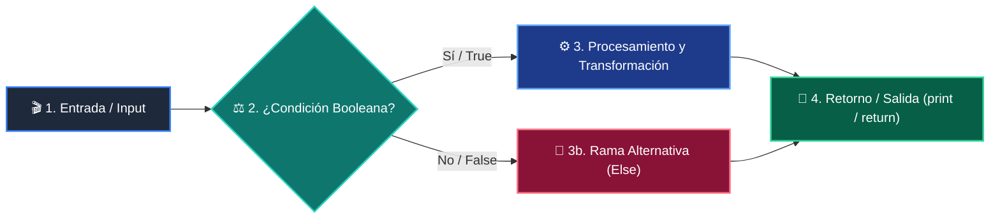

# 📚 Clase 02: Variables, Tipos de Datos y Operadores

> **Programa:** Curso 1: Fundamentos Básicos de Python  
> **Nivel:** Nivel 1 - Principiante  
> **Metáfora Central:** *«Variables como Cajas Etiquetadas en Memoria»*  
> **Documento Oficial PDF:** [clase-02-variables-y-tipos.pdf](clase-02-variables-y-tipos.pdf)  
> **Instructor:** **William Rodríguez (Wisrovi)** (AI Solutions Architect & Principal Software Engineer)  

---

## 👤 Perfil del Autor y Mentor

### **William Rodríguez (Wisrovi)**
*AI Solutions Architect & Principal Software Engineer &bull; Badajoz, España*

Ingeniero y arquitecto de software especializado en Inteligencia Artificial Generativa, sistemas multi-agente, Visión por Computador e infraestructuras MLOps de alta disponibilidad. Creador y mantenedor de la suite de software libre wisrovi SUITE en PyPI con más de 26 bibliotecas enfocadas en orquestación de pipelines, caching distribuido y optimización de bases de datos.

*   🐙 **GitHub:** [github.com/wisrovi](https://github.com/wisrovi)
*   💼 **LinkedIn:** [www.linkedin.com/in/wisrovi-rodriguez/](https://www.linkedin.com/in/wisrovi-rodriguez/)
*   🐳 **DockerHub:** [hub.docker.com/u/wisrovi](https://hub.docker.com/u/wisrovi)
*   🌐 **Website:** [wisrovi.dev](https://wisrovi.dev)
*   📦 **PyPI:** [pypi.org/user/wisrovi/](https://pypi.org/user/wisrovi/)

---

### 🚲 La Regla de la Bicicleta

> *"Nadie aprende a montar en bicicleta viendo tutoriales. El verdadero dominio de la programación surge cuando abres tu editor, escribes código con tus propias manos, resuelves errores y construyes proyectos reales."*

---

## 📑 Tabla de Contenidos de la Sesión

1. [💡 Fundamentación Teórica y Modelo Mental](#1--fundamentación-teórica-y-modelo-mental)
2. [🗺️ Arquitectura y Diagrama de Flujo](#2-️-arquitectura-y-diagrama-de-flujo)
3. [💻 Implementación en Python 3.10+](#3--implementación-en-python-310)
4. [🛡️ Buenas Prácticas y Trampas Frecuentes](#4-️-buenas-prácticas-y-trampas-frecuentes)
5. [🏋️ Desafío de Práctica](#5-️-desafío-de-práctica)
6. [📚 Bibliografía y Enlaces Canónicos](#6--bibliografía-y-enlaces-canónicos)

---

## 1. 💡 Fundamentación Teórica y Modelo Mental

En Python, las variables no almacenan el dato directamente, sino una referencia a un objeto en el heap de memoria.

> [!NOTE]
> **🌟 Metáfora Didáctica:** Una variable es una etiqueta adhesiva pegada a una caja; varias etiquetas pueden apuntar a la misma caja.

### Principios Fundamentales

Python es fuertemente tipado: no convierte tipos automáticamente sin orden explícita.

Los tipos primitivos (int, float, str, bool) son inmutables en memoria.

> [!IMPORTANT]
> **⚡ Regla de Oro en Python:** Convierte tipos explícitamente usando int() o float() antes de operar con entradas de usuario.

---

## 2. 🗺️ Arquitectura y Diagrama de Flujo

Asignación de referencias en memoria y conversión de tipos primitivos.



### Desglose Paso a Paso del Flujo

| Fase | Acción del Intérprete | Estado en Memoria |
| :--- | :--- | :--- |
| **1. Inicialización** | Declaración y asignación de literales. | `Creación del objeto en memoria.` |
| **2. Evaluación** | Enlace de la variable al identificador del objeto. | `Puntero en el namespace local.` |
| **3. Transformación** | Casting explícito (ej. float(input)). | `Nuevo objeto instanciado.` |
| **4. Retorno / Salida** | Evaluación de expresiones aritméticas. | `Resultado en memoria temporal.` |

> [!TIP]
> **🔍 Visualización Mental:** Usa la función id(variable) para observar cómo cambia la dirección al reasignar.

---

## 3. 💻 Implementación en Python 3.10+

```python
# CLASE 02 - Código de Demostración
edad: int = 28
precio: float = 19.99
nombre: str = "Wisrovi"
es_activo: bool = True

total = precio * 2
print(f"Usuario: {nombre} | Total a pagar: ${total:.2f}")
```

*Uso de Type Hints (PEP 484) y formateo de precisión con especificadores .2f.*

---

## 4. 🛡️ Buenas Prácticas y Trampas Frecuentes

> [!WARNING]
> **⚠️ Gotcha Frecuente (Trampa de Principiante):** input() siempre retorna un string; sumarlo directamente concatena texto.

*   **❌ Antipatrón:**
    ```python
edad = input('Edad: ')
total = edad + 5  # ❌ TypeError
    ```

*   **✅ Patrón Correcto:**
    ```python
edad = int(input('Edad: '))
total = edad + 5  # ✅ Correcto
    ```

> [!TIP]
> **💡 Consejo Profesional:** Siempre valida con bloques try/except al convertir entradas de usuario a números.

---

## 5. 🏋️ Desafío de Práctica

> **Desafío:** Crea una calculadora de propinas que solicite el total de la cuenta y el porcentaje deseado.

Para ejecutar la verificación automática con pytest:
```bash
pytest ejercicios/
```

---

## 6. 📚 Bibliografía y Enlaces Canónicos

| Fuente / Recurso | Descripción | Enlace |
| :--- | :--- | :--- |
| **Documentación Oficial de Python** | Especificación y biblioteca estándar | [docs.python.org/3/](https://docs.python.org/3/) |
| **PEP 8 — Style Guide for Python** | Estándar oficial de formateo y estilo | [peps.python.org/pep-0008/](https://peps.python.org/pep-0008/) |
| **Real Python Tutorials** | Patrones de ingeniería y desarrollo | [realpython.com](https://realpython.com/) |
| **Suite Open Source wisrovi** | Librerías de alto rendimiento | [github.com/wisrovi](https://github.com/wisrovi) |
