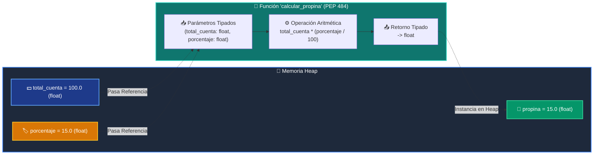

# 📚 Clase 02: Variables, Tipos de Datos y Funciones con Type Hints

> **Programa:** Curso 1: Fundamentos Básicos de Python  
> **Nivel:** Nivel 1 - Principiante  
> **Metáfora Central:** *«Variables como Cajas Etiquetadas en Memoria y la Licuadora Tipada (PEP 484)»*  
> **Documento Oficial PDF:** [clase-02-variables-y-tipos.pdf](clase-02-variables-y-tipos.pdf)  
> **Instructor:** **William Rodríguez (Wisrovi)** (AI Solutions Architect & Principal Software Engineer)  

---

## 👤 Perfil del Autor y Mentor

### **William Rodríguez (Wisrovi)**
*AI Solutions Architect & Principal Software Engineer &bull; Badajoz, España*

Ingeniero y arquitecto de software especializado en Inteligencia Artificial Generativa, sistemas multi-agente, Visión por Computador e infraestructuras MLOps de alta disponibilidad. Creador y mantenedor de la suite de software libre wisrovi SUITE en PyPI con más de 26 bibliotecas enfocadas en orquestación de pipelines, caching distribuido y optimización de bases de datos.

*   🐙 **GitHub:** [github.com/wisrovi](https://github.com/wisrovi)
*   💼 **LinkedIn:** [www.linkedin.com/in/wisrovi-rodriguez/](https://www.linkedin.com/in/wisrovi-rodriguez/)
*   🐳 **DockerHub:** [hub.docker.com/u/wisrovi](https://hub.docker.com/u/wisrovi)
*   🌐 **Website:** [wisrovi.dev](https://wisrovi.dev)
*   📦 **PyPI:** [pypi.org/user/wisrovi/](https://pypi.org/user/wisrovi/)

---

### 🚲 La Regla de la Bicicleta

> *"Nadie aprende a montar en bicicleta viendo tutoriales. El verdadero dominio de la programación surge cuando abres tu editor, escribes código con tus propias manos, resuelves errores y construyes proyectos reales."*

---

## 📑 Tabla de Contenidos de la Sesión

1. [💡 Fundamentación Teórica y Modelo Mental](#1--fundamentación-teórica-y-modelo-mental)
2. [🗺️ Arquitectura y Diagrama de Flujo](#2-️-arquitectura-y-diagrama-de-flujo)
3. [💻 Implementación en Python 3.10+](#3--implementación-en-python-310)
4. [🛡️ Buenas Prácticas y Trampas Frecuentes](#4-️-buenas-prácticas-y-trampas-frecuentes)
5. [🏋️ Desafío de Práctica](#5-️-desafío-de-práctica)
6. [📚 Bibliografía y Enlaces Canónicos](#6--bibliografía-y-enlaces-canónicos)

---

## 1. 💡 Fundamentación Teórica y Modelo Mental

En Python, las variables no almacenan el dato directamente dentro de un contenedor rígido, sino una **referencia (puntero)** a un objeto alojado en el **Heap de memoria**. 

Siguiendo el principio pedagógico del **Aprendizaje en Espiral**, en esta clase conectamos las variables y tipos de datos con las **funciones (`def`)** introducidas en la sesión anterior:

> [!NOTE]
> **🌟 Metáfora Didáctica:** Una variable es una etiqueta adhesiva pegada a una caja; varias etiquetas pueden apuntar a la misma caja. Una función es *«La Licuadora»*, que recibe referencias a esas cajas como parámetros tipados, procesa los datos y devuelve una nueva caja etiquetada en el Heap.

### Principios Fundamentales

1. **Tipado Dinámico y Fuerte:** Python determina los tipos en tiempo de ejecución, pero nunca fuerza conversiones implícitas incompatibles (`"10" + 5` lanzará `TypeError`).
2. **Type Hints (PEP 484):** Anotar tipos en variables y parámetros (`precio: float, personas: int -> float`) no altera el rendimiento en runtime, pero proporciona autocompletado y prevención de bugs en el editor.
3. **Inmutabilidad de Tipos Primitivos:** `int`, `float`, `str` y `bool` no pueden modificarse in-situ. Cualquier operación matemática o transformación de texto genera un nuevo objeto con un `id()` distinto.
4. **Paso por Asignación de Objetos:** Al pasar una variable a una función, el parámetro recibe la referencia al objeto existente. Si reasignas el parámetro, este apuntará a un nuevo objeto local sin alterar la variable original externa.

> [!IMPORTANT]
> **⚡ Regla de Oro en Python:** Convierte tipos explícitamente usando `int()` o `float()` antes de operar con entradas de usuario o fuentes de datos externas.

---

## 2. 🗺️ Arquitectura y Diagrama de Flujo

El siguiente diagrama ilustra cómo las variables fluyen hacia una función tipada, sufren transformaciones aritméticas y generan un nuevo objeto en el Heap de memoria:



### Desglose Paso a Paso del Flujo

| Fase | Acción del Intérprete | Estado en Memoria |
| :--- | :--- | :--- |
| **1. Declaración & Enlace** | Creación de literales y asignación de identificadores. | Punteros asignados en la tabla de símbolos local. |
| **2. Invocación de Función** | Paso de referencias de objetos como argumentos. | Los parámetros locales reciben los mismos punteros del Heap. |
| **3. Transformación & Casting** | Conversión explícita y evaluación de expresiones. | Se crean nuevos objetos inmutables temporales en el Heap. |
| **4. Retorno (`return`)** | Entrega de la referencia del resultado final. | La variable receptora enlaza el nuevo objeto generado. |

> [!TIP]
> **🔍 Visualización Mental:** Usa la función integrada `id(variable)` o el script interactivo `simulador_memoria.py` para observar las direcciones hexadecimales de tus objetos en tiempo real.

---

## 3. 💻 Implementación en Python 3.10+

```python
"""Módulo de demostración: Variables, Casting, Funciones Tipadas y f-strings."""

def calcular_resumen_pedido(
    producto: str, 
    precio_unitario_str: str, 
    cantidad: int, 
    tasa_iva: float = 0.21
) -> str:
    """Procesa una orden de compra realizando casting seguro y retornando un resumen tabulado."""
    # 1. Casting explícito de tipos
    precio_unitario: float = float(precio_unitario_str)
    
    # 2. Operaciones aritméticas tipadas
    subtotal: float = precio_unitario * cantidad
    monto_iva: float = subtotal * tasa_iva
    total_final: float = subtotal + monto_iva
    
    # 3. Formateo avanzado con f-strings (PEP 498)
    resumen = (
        f"{'=' * 45}\n"
        f"ORDEN DE COMPRA: {producto}\n"
        f"{'-' * 45}\n"
        f"Cantidad:         {cantidad:>10}\n"
        f"Precio Unitario:  ${precio_unitario:>9.2f}\n"
        f"Subtotal:         ${subtotal:>9.2f}\n"
        f"IVA ({tasa_iva * 100:.0f}%):       ${monto_iva:>9.2f}\n"
        f"{'=' * 45}\n"
        f"TOTAL A PAGAR:    ${total_final:>9.2f}\n"
        f"{'=' * 45}"
    )
    return resumen

if __name__ == "__main__":
    nombre_prod: str = "Teclado Mecánico RGB"
    precio_raw: str = "79.99"
    unidades: int = 2
    
    factura = calcular_resumen_pedido(nombre_prod, precio_raw, unidades)
    print(factura)
```

---

## 4. 🛡️ Buenas Prácticas y Trampas Frecuentes

> [!WARNING]
> **⚠️ Gotcha Frecuente (Trampa de Principiante):** `input()` siempre retorna un objeto de tipo `str`. Si intentas sumar directamente una entrada numérica con un número, obtendrás un `TypeError`, o si sumas dos strings, se concatenarán (`"10" + "5" = "105"`).

*   **❌ Antipatrón:**
    ```python
    precio = input("Precio: ")
    total = precio * 2  # ❌ Repite la cadena de texto: '10' * 2 = '1010'
    ```

*   **✅ Patrón Correcto:**
    ```python
    def calcular_doble(precio_str: str) -> float:
        precio_num: float = float(precio_str)
        return precio_num * 2  # ✅ Operación aritmética real: 10.0 * 2 = 20.0
    ```

> [!TIP]
> **💡 Consejo Profesional:** Define siempre el tipo esperado en las firmas de función (`total: float, propina: float -> float`). Facilita el mantenimiento, la detección temprana de errores con analizadores estáticos como *MyPy* y mejora la colaboración en equipo.

---

## 5. 🏋️ Desafío de Práctica

> **Desafío Oficial:** Construye una calculadora de propinas y facturación modular en [`ejercicios/reto.py`](ejercicios/reto.py) implementando:
> 1. `calcular_propina(total_cuenta: float, porcentaje: float) -> float`
> 2. `calcular_total_por_persona(total_cuenta: float, porcentaje: float, num_personas: int) -> float`
> 3. `formatear_factura(total_cuenta: float, propina: float, total_por_persona: float) -> str`

Para verificar automáticamente tu solución con la suite de pruebas unitarias:
```bash
pytest tests/curso_01/test_clase_02.py
```

---

## 6. 📚 Bibliografía y Enlaces Canónicos

| Fuente / Recurso | Descripción | Enlace |
| :--- | :--- | :--- |
| **Documentación Oficial de Python** | Especificación de tipos estándar y funciones built-in | [docs.python.org/3/library/stdtypes.html](https://docs.python.org/3/library/stdtypes.html) |
| **PEP 484 — Type Hints** | Estándar canónico de anotaciones de tipo | [peps.python.org/pep-0484/](https://peps.python.org/pep-0484/) |
| **PEP 8 — Style Guide for Python** | Estándar oficial de formateo y estilo | [peps.python.org/pep-0008/](https://peps.python.org/pep-0008/) |
| **Suite Open Source wisrovi** | Librerías de alto rendimiento en PyPI | [pypi.org/user/wisrovi/](https://pypi.org/user/wisrovi/) |
| **Real Python Tutorials** | Patrones de ingeniería y desarrollo | [realpython.com](https://realpython.com/) |
| **GitHub del Mentor** | Repositorios y proyectos de código abierto | [github.com/wisrovi](https://github.com/wisrovi) |

