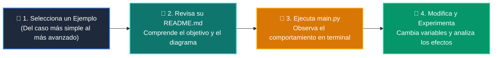

# 💻 Catálogo de Ejemplos Prácticos: Clase 02: Variables, Tipos de Datos y Operadores

> **Ubicación:** `curso/clase-02-variables-y-tipos/ejemplos`  
> **Filosofía:** *Aprender programando mediante casos de uso aislados, legibles y comentados.*

---

## 🗺️ Flujo de Estudio Recomendado



---

## 📑 Ejemplos Disponibles en esta Clase

| Directorio | Caso de Uso Demostrado | Script Principal |
| :--- | :--- | :---: |
| [`ejemplo_01_tipos_primitivos/`](ejemplo_01_tipos_primitivos/) | 01 Tipos Primitivos | [`main.py`](ejemplo_01_tipos_primitivos/main.py) |
| [`ejemplo_02_casting_y_conversion/`](ejemplo_02_casting_y_conversion/) | 02 Casting Y Conversion | [`main.py`](ejemplo_02_casting_y_conversion/main.py) |
| [`ejemplo_03_formateo_fstrings/`](ejemplo_03_formateo_fstrings/) | 03 Formateo Fstrings | [`main.py`](ejemplo_03_formateo_fstrings/main.py) |
| [`ejemplo_04_identidad_id_memoria/`](ejemplo_04_identidad_id_memoria/) | 04 Identidad Id Memoria | [`main.py`](ejemplo_04_identidad_id_memoria/main.py) |


---

## 🚀 Cómo Ejecutar Cualquier Ejemplo
Abre tu terminal en la raíz del repositorio y ejecuta:
```bash
python 01-fundamentos-python/clase-02-variables-y-tipos/ejemplos/<nombre_del_ejemplo>/main.py
```
