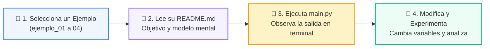

# 💻 Catálogo de Ejemplos Prácticos: Clase 02: Variables, Tipos de Datos y Operadores

> **Ubicación:** `01-fundamentos-python/clase-02-variables-y-tipos/ejemplos`  
> **Metodología:** *La Regla de la Bicicleta (Pedaleo en VS Code)*  

Esta carpeta contiene los ejemplos de código interactivos y comentados diseñados para ver la teoría en acción.

---

## 🌀 Flujo de Experimentación y Pedaleo



---

## 📑 Ejemplos Disponibles

| Subcarpeta | Tipo de Demostración | Archivo de Código |
| :--- | :--- | :---: |
| [`ejemplo_01_tipos_primitivos/`](ejemplo_01_tipos_primitivos/) | Demostración paso a paso | [`main.py`](ejemplo_01_tipos_primitivos/main.py) |
| [`ejemplo_02_casting_y_conversion/`](ejemplo_02_casting_y_conversion/) | Demostración paso a paso | [`main.py`](ejemplo_02_casting_y_conversion/main.py) |
| [`ejemplo_03_formateo_fstrings/`](ejemplo_03_formateo_fstrings/) | Demostración paso a paso | [`main.py`](ejemplo_03_formateo_fstrings/main.py) |
| [`ejemplo_04_identidad_id_memoria/`](ejemplo_04_identidad_id_memoria/) | Demostración paso a paso | [`main.py`](ejemplo_04_identidad_id_memoria/main.py) |


---

## 🚀 Cómo Ejecutar los Ejemplos
Desde la terminal en la raíz del repositorio:
```bash
python 01-fundamentos-python/clase-02-variables-y-tipos/ejemplos/<carpeta_ejemplo>/main.py
```
