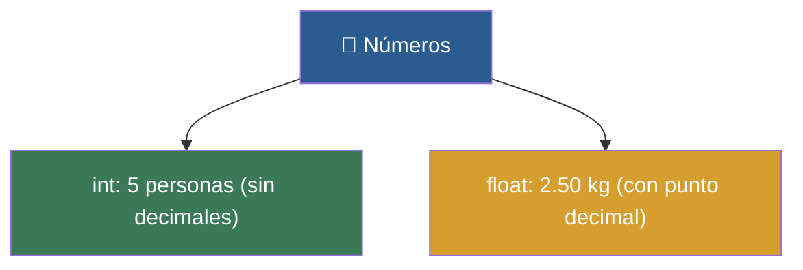

# 📑 Ejemplo 02: Monedas vs Báscula (int y float)

> **Concepto Clave:** Diferencia entre enteros (int) y números decimales (float).  
> **Metáfora:** Monedas vs Báscula: Contar objetos enteros (int) vs medir magnitudes continuas (float).

---

## 📊 Diagrama de Flujo del Ejemplo



---

## 🏃‍♂️ ¿Cómo ejecutar este ejemplo?

Abre tu terminal en VS Code y ejecuta:

```bash
python 01-fundamentos-python/clase-02-variables-y-tipos/ejemplos/ejemplo-02-numeros-enteros-y-decimales/02_numeros_enteros_y_decimales.py
```

---

## 📄 Explicación Paso a Paso

1. Lee detenidamente los comentarios dentro del archivo [`02_numeros_enteros_y_decimales.py`](02_numeros_enteros_y_decimales.py).
2. Ejecuta el código y observa la salida en consola.
3. Revisa la sección final del archivo para ver el resumen conceptual explicativo.
