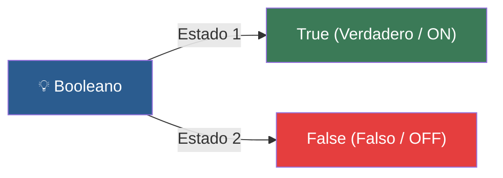

# 📑 Ejemplo 03: Los Interruptores de Luz (bool)

> **Concepto Clave:** Uso de valores de verdad (True / False) y comparaciones.  
> **Metáfora:** Interruptor de luz: Solo 2 estados posibles: Encendido (True) o Apagado (False).

---

## 📊 Diagrama de Flujo del Ejemplo



---

## 🏃‍♂️ ¿Cómo ejecutar este ejemplo?

Abre tu terminal en VS Code y ejecuta:

```bash
python 01-fundamentos-python/clase-02-variables-y-tipos/ejemplos/ejemplo-03-booleanos-los-interruptores/03_booleanos_los_interruptores.py
```

---

## 📄 Explicación Paso a Paso

1. Lee detenidamente los comentarios dentro del archivo [`03_booleanos_los_interruptores.py`](03_booleanos_los_interruptores.py).
2. Ejecuta el código y observa la salida en consola.
3. Revisa la sección final del archivo para ver el resumen conceptual explicativo.
