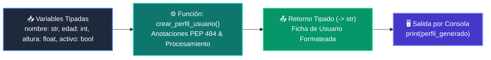

# 📖 Ejemplo 01: Tipos Primitivos, Type Hints y Funciones Modulares

<div align="center">

**Clase:** Clase 02: Variables, Tipos de Datos y Operadores  
*Script de Ejecución:* [`main.py`](main.py)

</div>

---

## 🎯 Propósito del Ejemplo
Demostrar la declaración e interpolación de los 4 tipos primitivos fundamentales de Python (`str`, `int`, `float`, `bool`) encapsulados dentro de una función con **Type Hints (PEP 484)** y tipo de retorno explícito.

---

## 🗺️ Diagrama de Flujo del Script



---

## 🔍 Aspectos Clave a Observar en el Código

1. **Anotaciones de Tipo (PEP 484):** Cada parámetro de la función declara su tipo esperado (`nombre: str`, `edad: int`, `altura: float`, `es_estudiante: bool`) y su tipo de retorno (`-> str`).
2. **Inspección Dinámica con `type()`:** Uso de `type(variable).__name__` para comprobar en tiempo de ejecución el tipo real de cada objeto.
3. **Expresión Condicional Ternaria:** Determinación del estado del alumno en una sola línea elegante: `'Estudiante Activo' if es_estudiante else 'Profesional'`.

---

## 💻 Ejecución desde la Terminal

Desde la raíz del proyecto, ejecuta:

```bash
python 01-fundamentos-python/clase-02-variables-y-tipos/ejemplos/ejemplo_01_tipos_primitivos/main.py
```
