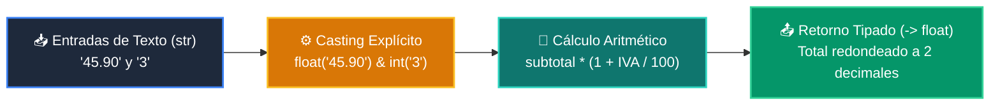

# 📖 Ejemplo 02: Casting y Conversión Segura de Tipos con Funciones

<div align="center">

**Clase:** Clase 02: Variables, Tipos de Datos y Operadores  
*Script de Ejecución:* [`main.py`](main.py)

</div>

---

## 🎯 Propósito del Ejemplo
Demostrar la conversión explícita de tipos (*casting*) al procesar entradas textuales (`str`) transformándolas a números (`float` e `int`) dentro de una función de cálculo financiero.

---

## 🗺️ Diagrama de Flujo del Script



---

## 🔍 Aspectos Clave a Observar en el Código

1. **Casting Explícito:** `float(precio_str)` e `int(cantidad_str)` evitan el clásico error de concatenación accidental.
2. **Parámetros con Valor por Defecto:** La tasa de impuesto `impuesto_porcentaje: float = 21.0` permite flexibilidad en la llamada.
3. **Control de Precisión:** Uso de `round(total_con_impuesto, 2)` para asegurar exactitud monetaria antes del retorno.

---

## 💻 Ejecución desde la Terminal

Desde la raíz del proyecto, ejecuta:

```bash
python 01-fundamentos-python/clase-02-variables-y-tipos/ejemplos/ejemplo_02_casting_y_conversion/main.py
```
