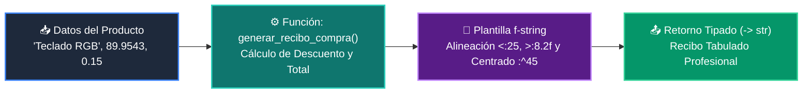

# 📖 Ejemplo 03: F-Strings Avanzados y Formateo Financiero con Funciones

<div align="center">

**Clase:** Clase 02: Variables, Tipos de Datos y Operadores  
*Script de Ejecución:* [`main.py`](main.py)

</div>

---

## 🎯 Propósito del Ejemplo
Demostrar el poder de los **f-strings en Python 3.10+** para alineación de texto (`<`, `>`, `^`), formato de porcentajes (`.1%`) y redondeo visual de decimales (`.2f`) dentro de una función generadora de recibos.

---

## 🗺️ Diagrama de Flujo del Script



---

## 🔍 Aspectos Clave a Observar en el Código

1. **Alineación y Relleno:** `{producto:<25}` alinea a la izquierda con ancho 25; `{titulo:^45}` centra el texto; `{precio:>8.2f}` alinea a la derecha.
2. **Formato Numérico Decimal:** `{precio:.2f}` asegura visualización con exactamente dos decimales sin alterar el valor aritmético original.
3. **Composición de Cadenas Limpia:** Uso de tuplas de cadenas con paréntesis para evitar líneas infinitas respetando PEP 8.

---

## 💻 Ejecución desde la Terminal

Desde la raíz del proyecto, ejecuta:

```bash
python 01-fundamentos-python/clase-02-variables-y-tipos/ejemplos/ejemplo_03_formateo_fstrings/main.py
```
