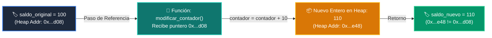

# 📖 Ejemplo 04: Identidad en Memoria (id), Operador 'is' y Parámetros en Funciones

<div align="center">

**Clase:** Clase 02: Variables, Tipos de Datos y Operadores  
*Script de Ejecución:* [`main.py`](main.py)

</div>

---

## 🎯 Propósito del Ejemplo
Demostrar el modelo de **paso de parámetros por asignación de objetos** en Python, la inspección de direcciones en la memoria Heap con `id()` / `hex()` y cómo la reasignación de tipos inmutables dentro de una función crea nuevos objetos sin mutar el original externo.

---

## 🗺️ Diagrama de Flujo del Script



---

## 🔍 Aspectos Clave a Observar en el Código

1. **Paso por Asignación:** Al invocar `modificar_contador(saldo_original)`, el parámetro local `contador` apunta exactamente al mismo objeto en memoria inicial.
2. **Inmutabilidad en Acción:** Al ejecutar `contador + 10`, Python no modifica el entero `100` existente, sino que crea un nuevo objeto `110` con una dirección hexadecimal diferente.
3. **Operador `is`:** Comprueba si dos variables comparten la misma identidad física de memoria (`id(a) == id(b)`).

---

## 💻 Ejecución desde la Terminal

Desde la raíz del proyecto, ejecuta:

```bash
python 01-fundamentos-python/clase-02-variables-y-tipos/ejemplos/ejemplo_04_identidad_id_memoria/main.py
```
