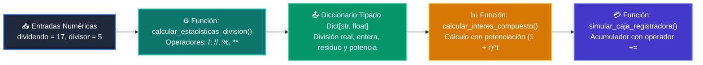

# 📖 Ejemplo 05: Operadores Aritméticos y Asignación Aumentada

<div align="center">

**Clase:** Clase 02: Variables, Tipos de Datos y Operadores  
*Script de Ejecución:* [`main.py`](main.py)

</div>

---

## 🎯 Propósito del Ejemplo
Dominar los operadores aritméticos fundamentales de Python:
* División decimal (`/`) vs División entera (`//`)
* Módulo / Residuo (`%`)
* Potenciación (`**`)
* Asignación aumentada (`+=`, `-=`, `*=`, `/=`)
Todo estructurado dentro de funciones tipadas bajo el estándar **PEP 484**.

---

## 🗺️ Diagrama de Flujo del Script



---

## 🔍 Aspectos Clave a Observar en el Código

1. **Diferencia entre `/` y `//`:** `/` siempre devuelve un `float` (ej. `17 / 5 = 3.4`), mientras que `//` trunca al entero inferior (ej. `17 // 5 = 3`).
2. **Utilidad del Módulo (`%`):** `17 % 5 = 2` obtiene el residuo, fundamental para determinar paridad (`x % 2 == 0`) o ciclos periódicos.
3. **Operadores de Asignación (`+=`):** `saldo += monto` es equivalente a `saldo = saldo + monto`, pero más conciso y Pythonic.

---

## 💻 Ejecución desde la Terminal

Desde la raíz del proyecto, ejecuta:

```bash
python 01-fundamentos-python/clase-02-variables-y-tipos/ejemplos/ejemplo_05_operadores_aritmeticos_y_asignacion/main.py
```
