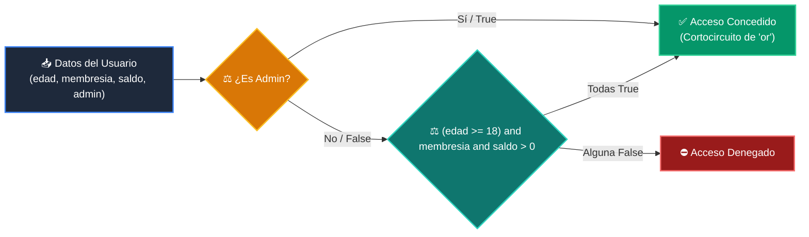

# 📖 Ejemplo 06: Operadores de Comparación, Lógicos y Cortocircuito

<div align="center">

**Clase:** Clase 02: Variables, Tipos de Datos y Operadores  
*Script de Ejecución:* [`main.py`](main.py)

</div>

---

## 🎯 Propósito del Ejemplo
Comprender la evaluación de expresiones booleanas complejas utilizando:
* Operadores relacionales (`==`, `!=`, `<`, `>`, `<=`, `>=`)
* Comparaciones encadenadas (`a <= x <= b`)
* Operadores lógicos (`and`, `or`, `not`)
* Evaluación en cortocircuito (*Short-circuit evaluation*) para evitar errores en tiempo de ejecución.

---

## 🗺️ Diagrama de Flujo del Script



---

## 🔍 Aspectos Clave a Observar en el Código

1. **Comparación Encadenada Pythonic:** `min_confort <= temp <= max_confort` es mucho más legible que `temp >= min_confort and temp <= max_confort`.
2. **Evaluación en Cortocircuito:** En `(numero != 0) and ((100 / numero) > 2)`, si `numero == 0`, la primera parte es `False` y Python no ejecuta la división, evitando un fatal `ZeroDivisionError`.
3. **Precedencia de Operadores:** Los operadores relacionales se evalúan antes que `not`, `and`, y finalmente `or`. Se recomienda usar paréntesis para máxima legibilidad.

---

## 💻 Ejecución desde la Terminal

Desde la raíz del proyecto, ejecuta:

```bash
python 01-fundamentos-python/clase-02-variables-y-tipos/ejemplos/ejemplo_06_operadores_comparacion_y_logicos/main.py
```
