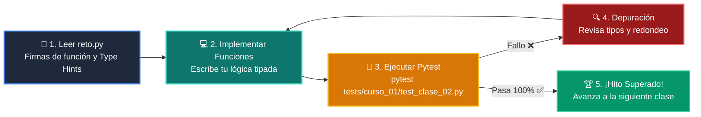

# 🏋️ Reto Práctico: Clase 02: Variables, Tipos de Datos y Funciones Modulares

<div align="center">

**Curso 1: Fundamentos Básicos de Python** &bull; **Semana CLASE 02**  
*Archivo de Trabajo:* [`reto.py`](reto.py) &bull; *Suite de Validación:* [`tests/curso_01/test_clase_02.py`](../../../tests/curso_01/test_clase_02.py)

</div>

---

## 🎯 Enunciado del Desafío

> **Construye una calculadora de propinas y facturación modular implementando 3 funciones con Type Hints (PEP 484):**
> 1. `calcular_propina(total_cuenta: float, porcentaje: float) -> float`
> 2. `calcular_total_por_persona(total_cuenta: float, porcentaje: float, num_personas: int) -> float`
> 3. `formatear_factura(total_cuenta: float, propina: float, total_por_persona: float) -> str`

---

## 🗺️ Ciclo de Resolución y Feedback Automatizado



---

## 🚀 Pasos para Resolver el Reto

1. Abre [`reto.py`](reto.py) en tu editor.
2. Lee las firmas de función, docstrings y anotaciones de tipo.
3. Escribe tu solución implementando los cálculos aritméticos y el formateo con f-strings.
4. Valida tu solución en cualquier momento ejecutando en la terminal:
   ```bash
   pytest tests/curso_01/test_clase_02.py
   ```

