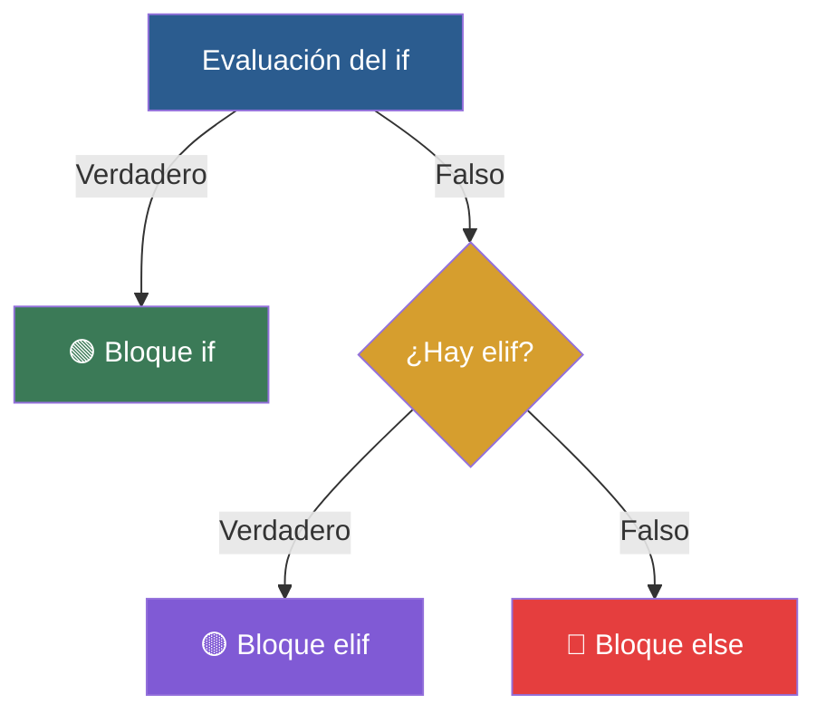

# 🚥 Clase 03: Toma de Decisiones (if, elif, else)

> **Objetivo:** Aprender a controlar el flujo de ejecución evaluando condiciones simples y compuestas.

---

## 💡 Diagrama Conceptual de la Clase

---

## 📚 Ejemplos Prácticos de la Clase

| Ejemplo | Concepto Principal | Metáfora del Mundo Real | Enlace al Material |
| :--- | :--- | :--- | :---: |
| **Ejemplo 01** | Ejecución condicional simple. | *El Guardia* | [📁 Ver Ejemplo](ejemplos/ejemplo-01-if-simple-el-guardia/) |
| **Ejemplo 02** | Elección binaria entre dos alternativas exclusivas. | *La Moneda* | [📁 Ver Ejemplo](ejemplos/ejemplo-02-if-else-la-moneda/) |
| **Ejemplo 03** | Múltiples opciones alternativas con elif. | *Menú del restaurante* | [📁 Ver Ejemplo](ejemplos/ejemplo-03-elif-el-menu-restaurante/) |
| **Ejemplo 04** | Combinar múltiples expresiones lógicas con and, or, not. | *Cerradura Doble* | [📁 Ver Ejemplo](ejemplos/ejemplo-04-operadores-logicos-doble-llave/) |
| **Ejemplo 05** | Estructuras if dentro de otros bloques if. | *Control del Aeropuerto* | [📁 Ver Ejemplo](ejemplos/ejemplo-05-condicionales-anidados-aeropuerto/) |

---

## 🏋️ Ejercicio Práctico de la Clase

Revisa la carpeta de [ejercicios/](ejercicios/) para aplicar los conocimientos adquiridos.
