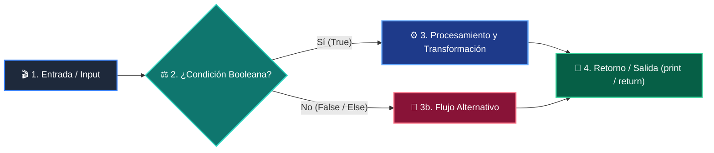

# 📖 Clase 03: Control de Flujo - Condicionales

> **Programa:** Curso 1: Fundamentos Básicos de Python (Nivel 1 (Principiantes))  
> **Nivel de Dificultad:** Principiante Absoluto  
> **Metáfora Central:** *«El Guardia de la Puerta y el Menú de Opciones»*  
> **Python Version:** 3.10+ | **Licencia:** MIT  

---

## 👤 Acerca del Autor y Mentor

### **William Rodríguez (Wisrovi)**
**AI Solutions Architect & Principal Software Engineer** &bull; *Badajoz, España*

Ingeniero y arquitecto de software especializado en Inteligencia Artificial Generativa, sistemas multi-agente, Visión por Computador e infraestructuras MLOps de alta disponibilidad. Creador y mantenedor de la suite de software libre <strong>wisrovi SUITE</strong> en PyPI con más de 26 bibliotecas enfocadas en orquestación de pipelines, caching distribuido y optimización de bases de datos.

*   🐙 **GitHub:** [github.com/wisrovi](https://github.com/wisrovi)
*   💼 **LinkedIn:** [www.linkedin.com/in/wisrovi-rodriguez/](https://www.linkedin.com/in/wisrovi-rodriguez/)
*   🐳 **DockerHub:** [hub.docker.com/u/wisrovi](https://hub.docker.com/u/wisrovi)
*   🌐 **Website:** [wisrovi.dev](https://wisrovi.dev)
*   📦 **PyPI:** [pypi.org/user/wisrovi/](https://pypi.org/user/wisrovi/)

---

### 🚲 Metodología de Aprendizaje: La Regla de la Bicicleta

> *"Nadie aprende a montar en bicicleta viendo tutoriales. El verdadero dominio de la programación surge cuando abres tu editor, escribes código con tus propias manos, resuelves errores y construyes proyectos reales."*

> [!TIP]
> **El Compromiso Activo del Estudiante:** Abre Visual Studio Code en cada sesión. Escribe cada ejemplo con tus propias manos. Cambia los números, rompe el código deliberadamente para ver el mensaje de error de Python, y luego arréglalo.

---

## 📑 Tabla de Contenidos

| Capítulo | Tema | Enfoque Principal |
| :--- | :--- | :--- |
| **01** | **Fundamentos & Metáfora** | Bifurcaciones Lógicas y Toma de Decisiones |
| **02** | **Arquitectura de Flujo** | Árbol de Decisión y Evaluación de Condiciones |
| **03** | **Implementación Práctica** | Sistema de Clasificación de Préstamos Bancarios |
| **04** | **Patrones & Debugging** | Errores Frecuentes con Condicionales |
| **05** | **Conclusiones & Cierre** | Resumen ejecutivo, notas del mentor y agradecimiento |
| **06** | **Bibliografía & Recursos** | Fuentes oficiales y retos de autoestudio |

### 🎯 Objetivos de Aprendizaje

*   **Competencia Conceptual:** Comprender la evaluación de expresiones booleanas y la exclusión mutua en cadenas if-elif-else.
*   **Competencia Práctica:** Implementar sistemas de validación de reglas de negocio, control de acceso y árboles de decisión.

---

## 1. 💡 Bifurcaciones Lógicas y Toma de Decisiones

Un programa no es una línea recta; es un camino con encrucijadas donde el flujo toma una dirección según las condiciones.

> [!NOTE]
> ### 🌟 Metáfora Central: El Guardia de la Puerta y el Menú de Opciones
> Imagina un guardia en la entrada de un club: revisa tu entrada (if). Si tienes pase VIP entra gratis (if), si tienes entrada general paga boleto (elif), y si no tienes entrada se le deniega el acceso (else).

### Principios Teóricos y Modelo Mental

Operadores relacionales: == (igualdad), != (diferente), > (mayor), < (menor), >= (mayor o igual), <= (menor o igual).

Operadores lógicos: and (ambas condiciones deben ser True), or (al menos una True), not (invierte el valor de verdad).

> [!IMPORTANT]
> ### ⚡ Regla de Oro en Python
> En una cadena if-elif-else, tan pronto como una condición resulta True, se ejecuta su bloque y se omiten todas las demás.

---

## 2. 🗺️ Árbol de Decisión y Evaluación de Condiciones

Representación del flujo booleano con múltiples alternativas excluyentes.

### Diagrama Visual del Flujo



### Desglose Paso a Paso del Flujo

| Fase del Flujo | Acción del Intérprete | Estado en Memoria |
| :--- | :--- | :--- |
| **1. Inicialización** | Evalúa la primera condición del if principal. | `Condición 1: ¿edad >= 18?` |
| **2. Evaluación** | Si es True, entra al bloque if y salta al final de la estructura. | `Ejecuta bloque prioritario` |
| **3. Transformación** | Si es False, evalúa secuencialmente los bloques elif. | `Condición 2: ¿tiene_permiso?` |
| **4. Retorno / Salida** | Si ninguna condición previa fue True, se ejecuta el bloque else por defecto. | `Rama fallback de seguridad` |

> [!TIP]
> **Visualización Mental:** Ordena tus condiciones de la más específica a la más general para evitar que un caso amplio oculte casos particulares.

---

## 3. 💻 Sistema de Clasificación de Préstamos Bancarios

Ejemplo práctico con operadores lógicos combinados y evaluación de reglas financieras:

```python
# main.py - Python 3.10+ PEP 8 Compliant
salario = float(input("Salario mensual ($): "))
puntaje_credito = int(input("Puntaje crediticio (300-850): "))
tiene_deudas = input("¿Tiene deudas activas? (s/n): ").lower() == "s"

if salario >= 3000.0 and puntaje_credito >= 720 and not tiene_deudas:
    estado = "Aprobado Premium (Tasa de interés preferencial)"
elif salario >= 1800.0 and puntaje_credito >= 650:
    estado = "Aprobado Estándar (Sujeto a verificación)"
elif salario >= 1200.0 or puntaje_credito >= 600:
    estado = "Requiere Codeudor o Aval"
else:
    estado = "Rechazado (No cumple los requisitos mínimos)"

print(f"
Resultado de la solicitud: {estado}")
```

### Análisis del Código Fuente

El código implementa lógica booleana compuesta con and, not y or, garantizando una jerarquía de evaluación limpia.

---

## 4. 🛡️ Errores Frecuentes con Condicionales

Trampas clásicas de sintaxis y lógica booleana en Python:

> [!WARNING]
> ### ⚠️ Gotcha Frecuente (Trampa de Principiante)
> Confundir el operador de asignación (=) con el operador de comparación (==).

### Comparativa: Antipatrón vs Patrón Recomendado

#### ❌ Antipatrón / Mal Código:
```python
if rol = "admin": # SyntaxError
    print("Acceso total")
```

#### ✅ Patrón Pythonic / Correcto:
```python
if rol == "admin": # Comparación correcta
    print("Acceso total")
```

> [!TIP]
> **Consejo de Resiliencia en Producción:** Aprovecha la evaluación de cortocircuito (short-circuit evaluation) en Python para proteger llamadas riesgosas.

---

## 5. 🏆 Conclusiones y Resumen Ejecutivo

Has dominado el núcleo de la toma de decisiones en software mediante condicionales y lógica booleana.

> [!NOTE]
> ### 🎖️ Logro Alcanzado
> Capacidad para codificar flujos lógicos complejos y reglas de negocio robustas.

### 📝 Notas del Instructor
En la próxima clase abordaremos la repetición inteligente: bucles for y while para procesar volúmenes masivos de datos.

### 🤝 Mensaje de Agradecimiento
Muchas gracias por tu entusiasmo, disciplina y dedicación al participar en este programa formativo. La programación es un superpoder que transforma vidas cuando se ejerce con constancia y curiosidad. ¡Nos vemos en la próxima sesión para seguir construyendo juntos! 💻🚀

---

## 6. 📚 Bibliografía y Fuentes de Estudio

| Fuente / Recurso | Descripción Temática | Enlace Oficial |
| :--- | :--- | :--- |
| **Documentación Oficial de Python** | Referencia canónica del lenguaje y librería estándar | [docs.python.org/3/](https://docs.python.org/3/) |
| **PEP 8 — Style Guide for Python** | Guía oficial de estilo, formato e indentación | [peps.python.org/pep-0008/](https://peps.python.org/pep-0008/) |
| **Real Python Tutorials** | Artículos técnicos y patrones de desarrollo moderno | [realpython.com](https://realpython.com/) |
| **Python Type Checking (PEP 484)** | Anotaciones de tipo y análisis estático | [docs.python.org/typing](https://docs.python.org/3/library/typing.html) |
| **Suite Open Source wisrovi** | Paquetes Python para orquestación y rendimiento | [github.com/wisrovi](https://github.com/wisrovi) |

> [!TIP]
> ### 🏋️ Desafío de Autoestudio Recomendado
> Diseña un sistema de tarificación de boletos de cine con descuentos por edad, día de la semana y membresía VIP.
