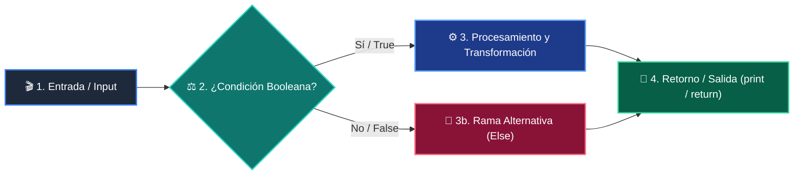

# 📚 Clase 03: Control de Flujo: Condicionales (if / elif / else)

> **Programa:** Curso 1: Fundamentos Básicos de Python  
> **Nivel:** Nivel 1 - Principiante  
> **Metáfora Central:** *«Condicionales como Semáforos y Bifurcaciones en un Tren»*  
> **Documento Oficial PDF:** [clase-03-control-flujo-condicionales.pdf](clase-03-control-flujo-condicionales.pdf)  
> **Instructor:** **William Rodríguez (Wisrovi)** (AI Solutions Architect & Principal Software Engineer)  

---

## 👤 Perfil del Autor y Mentor

### **William Rodríguez (Wisrovi)**
*AI Solutions Architect & Principal Software Engineer &bull; Badajoz, España*

Ingeniero y arquitecto de software especializado en Inteligencia Artificial Generativa, sistemas multi-agente, Visión por Computador e infraestructuras MLOps de alta disponibilidad. Creador y mantenedor de la suite de software libre wisrovi SUITE en PyPI con más de 26 bibliotecas enfocadas en orquestación de pipelines, caching distribuido y optimización de bases de datos.

*   🐙 **GitHub:** [github.com/wisrovi](https://github.com/wisrovi)
*   💼 **LinkedIn:** [www.linkedin.com/in/wisrovi-rodriguez/](https://www.linkedin.com/in/wisrovi-rodriguez/)
*   🐳 **DockerHub:** [hub.docker.com/u/wisrovi](https://hub.docker.com/u/wisrovi)
*   🌐 **Website:** [wisrovi.dev](https://wisrovi.dev)
*   📦 **PyPI:** [pypi.org/user/wisrovi/](https://pypi.org/user/wisrovi/)

---

### 🚲 La Regla de la Bicicleta

> *"Nadie aprende a montar en bicicleta viendo tutoriales. El verdadero dominio de la programación surge cuando abres tu editor, escribes código con tus propias manos, resuelves errores y construyes proyectos reales."*

---

## 📑 Tabla de Contenidos de la Sesión

1. [💡 Fundamentación Teórica y Modelo Mental](#1--fundamentación-teórica-y-modelo-mental)
2. [🗺️ Arquitectura y Diagrama de Flujo](#2-️-arquitectura-y-diagrama-de-flujo)
3. [💻 Implementación en Python 3.10+](#3--implementación-en-python-310)
4. [🛡️ Buenas Prácticas y Trampas Frecuentes](#4-️-buenas-prácticas-y-trampas-frecuentes)
5. [🏋️ Desafío de Práctica](#5-️-desafío-de-práctica)
6. [📚 Bibliografía y Enlaces Canónicos](#6--bibliografía-y-enlaces-canónicos)

---

## 1. 💡 Fundamentación Teórica y Modelo Mental

Las estructuras condicionales permiten que tu programa tome decisiones autónomas basadas en condiciones booleanas.

> [!NOTE]
> **🌟 Metáfora Didáctica:** Un condicional es como una aguja ferroviaria que desvía el tren según el color del semáforo.

### Principios Fundamentales

Python evalúa las condiciones de forma secuencial; la primera rama que resulte True ejecuta su bloque.

Cortocircuito booleano: En 'A and B', si A es False, B ni siquiera se evalúa.

> [!IMPORTANT]
> **⚡ Regla de Oro en Python:** Mantén las condiciones planas: evita anidar más de 3 niveles de if.

---

## 2. 🗺️ Arquitectura y Diagrama de Flujo

Evaluación condicional de ramas múltiples (if - elif - else).



### Desglose Paso a Paso del Flujo

| Fase | Acción del Intérprete | Estado en Memoria |
| :--- | :--- | :--- |
| **1. Inicialización** | Evaluación de la condición primaria (if). | `Valor de verdad True/False.` |
| **2. Evaluación** | Desvío a rama elif en caso de False. | `Paso a la siguiente condición.` |
| **3. Transformación** | Ejecución del bloque correspondiente. | `Ejecución del scope indentado.` |
| **4. Retorno / Salida** | Salida de la estructura hacia el flujo principal. | `Continuación lineal.` |

> [!TIP]
> **🔍 Visualización Mental:** Lee las condiciones en voz alta como preguntas de 'Sí o No'.

---

## 3. 💻 Implementación en Python 3.10+

```python
# CLASE 03 - Código de Demostración
puntaje = 85

if puntaje >= 90:
    calificacion = "A - Excelente"
elif puntaje >= 80:
    calificacion = "B - Notable"
elif puntaje >= 70:
    calificacion = "C - Aprobado"
else:
    calificacion = "D - Refuerzo"

print(f"Resultado final: {calificacion}")
```

*Uso de elif para evaluar rangos mutuamente excluyentes en orden descendente.*

---

## 4. 🛡️ Buenas Prácticas y Trampas Frecuentes

> [!WARNING]
> **⚠️ Gotcha Frecuente (Trampa de Principiante):** Usar 'is' para comparar números o strings; 'is' compara direcciones de memoria.

*   **❌ Antipatrón:**
    ```python
if nombre is 'Juan':  # ❌ SyntaxWarning
    ```

*   **✅ Patrón Correcto:**
    ```python
if nombre == 'Juan':  # ✅ Comparación correcta
    ```

> [!TIP]
> **💡 Consejo Profesional:** Usa 'is' únicamente para comparar con None (ej. if valor is None:).

---

## 5. 🏋️ Desafío de Práctica

> **Desafío:** Diseña un clasificador de acceso por edad y membresía VIP.

Para ejecutar la verificación automática con pytest:
```bash
pytest ejercicios/
```

---

## 6. 📚 Bibliografía y Enlaces Canónicos

| Fuente / Recurso | Descripción | Enlace |
| :--- | :--- | :--- |
| **Documentación Oficial de Python** | Especificación y biblioteca estándar | [docs.python.org/3/](https://docs.python.org/3/) |
| **PEP 8 — Style Guide for Python** | Estándar oficial de formateo y estilo | [peps.python.org/pep-0008/](https://peps.python.org/pep-0008/) |
| **Real Python Tutorials** | Patrones de ingeniería y desarrollo | [realpython.com](https://realpython.com/) |
| **Suite Open Source wisrovi** | Librerías de alto rendimiento | [github.com/wisrovi](https://github.com/wisrovi) |
