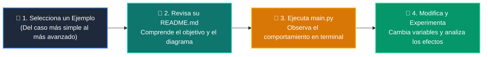

# 💻 Catálogo de Ejemplos Prácticos: Clase 03: Control de Flujo: Condicionales (if / elif / else)

> **Ubicación:** `curso/clase-03-control-flujo-condicionales/ejemplos`  
> **Filosofía:** *Aprender programando mediante casos de uso aislados, legibles y comentados.*

---

## 🗺️ Flujo de Estudio Recomendado



---

## 📑 Ejemplos Disponibles en esta Clase

| Directorio | Caso de Uso Demostrado | Script Principal |
| :--- | :--- | :---: |
| [`ejemplo_01_if_else_simple/`](ejemplo_01_if_else_simple/) | 01 If Else Simple | [`main.py`](ejemplo_01_if_else_simple/main.py) |
| [`ejemplo_02_elif_escalonado/`](ejemplo_02_elif_escalonado/) | 02 Elif Escalonado | [`main.py`](ejemplo_02_elif_escalonado/main.py) |
| [`ejemplo_03_operadores_logicos/`](ejemplo_03_operadores_logicos/) | 03 Operadores Logicos | [`main.py`](ejemplo_03_operadores_logicos/main.py) |
| [`ejemplo_04_operador_ternario/`](ejemplo_04_operador_ternario/) | 04 Operador Ternario | [`main.py`](ejemplo_04_operador_ternario/main.py) |


---

## 🚀 Cómo Ejecutar Cualquier Ejemplo
Abre tu terminal en la raíz del repositorio y ejecuta:
```bash
python 01-fundamentos-python/clase-03-control-flujo-condicionales/ejemplos/<nombre_del_ejemplo>/main.py
```
