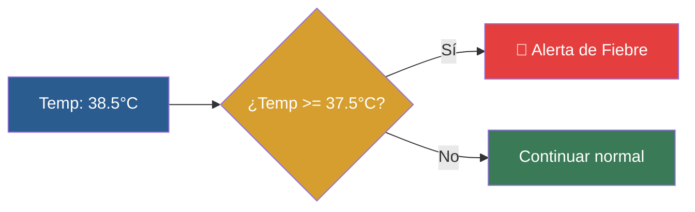

# 📑 Ejemplo 01: El Guardia de Seguridad (if simple)

> **Concepto Clave:** Ejecución condicional simple.  
> **Metáfora:** El Guardia: Si la temperatura es mayor a 37.5°C, da la voz de alerta.

---

## 📊 Diagrama de Flujo del Ejemplo



---

## 🏃‍♂️ ¿Cómo ejecutar este ejemplo?

Abre tu terminal en VS Code y ejecuta:

```bash
python 01-fundamentos-python/clase-03-control-flujo-condicionales/ejemplos/ejemplo-01-if-simple-el-guardia/01_if_simple_el_guardia.py
```

---

## 📄 Explicación Paso a Paso

1. Lee detenidamente los comentarios dentro del archivo [`01_if_simple_el_guardia.py`](01_if_simple_el_guardia.py).
2. Ejecuta el código y observa la salida en consola.
3. Revisa la sección final del archivo para ver el resumen conceptual explicativo.
