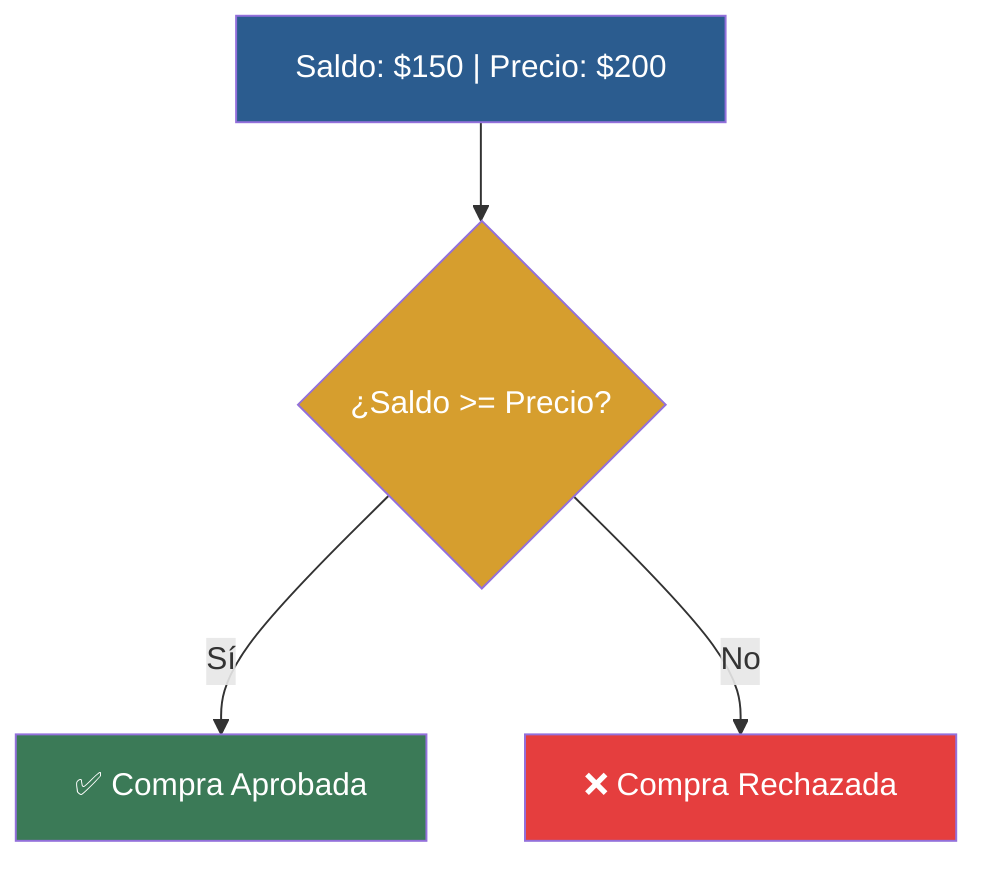

# 📑 Ejemplo 02: La Moneda al Aire (if / else)

> **Concepto Clave:** Elección binaria entre dos alternativas exclusivas.  
> **Metáfora:** La Moneda: Si hay saldo compra aprobada (Cara); de lo contrario rechazada (Cruz).

---

## 📊 Diagrama de Flujo del Ejemplo



---

## 🏃‍♂️ ¿Cómo ejecutar este ejemplo?

Abre tu terminal en VS Code y ejecuta:

```bash
python 01-fundamentos-python/clase-03-control-flujo-condicionales/ejemplos/ejemplo-02-if-else-la-moneda/02_if_else_la_moneda.py
```

---

## 📄 Explicación Paso a Paso

1. Lee detenidamente los comentarios dentro del archivo [`02_if_else_la_moneda.py`](02_if_else_la_moneda.py).
2. Ejecuta el código y observa la salida en consola.
3. Revisa la sección final del archivo para ver el resumen conceptual explicativo.
