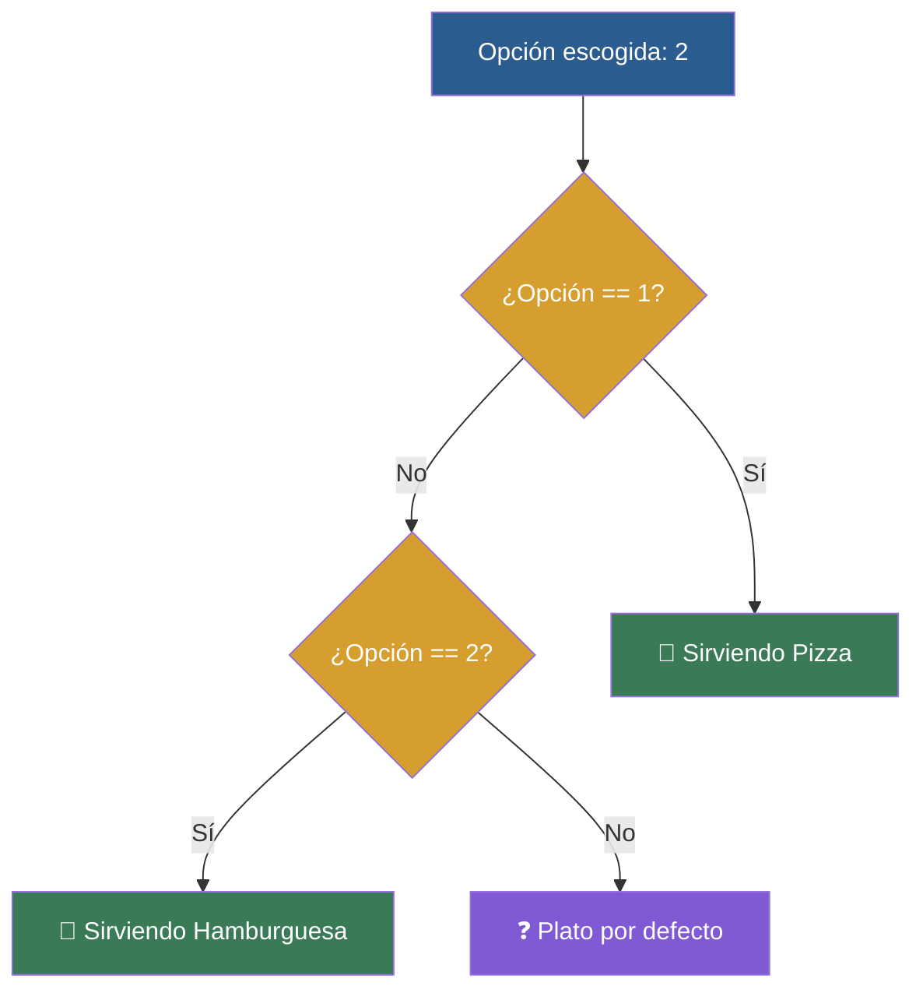

# 📑 Ejemplo 03: El Menú del Restaurante (elif múltiple)

> **Concepto Clave:** Múltiples opciones alternativas con elif.  
> **Metáfora:** Menú del restaurante: Opción 1, Opción 2, Opción 3 o plato por defecto.

---

## 📊 Diagrama de Flujo del Ejemplo



---

## 🏃‍♂️ ¿Cómo ejecutar este ejemplo?

Abre tu terminal en VS Code y ejecuta:

```bash
python 01-fundamentos-python/clase-03-control-flujo-condicionales/ejemplos/ejemplo-03-elif-el-menu-restaurante/03_elif_el_menu_restaurante.py
```

---

## 📄 Explicación Paso a Paso

1. Lee detenidamente los comentarios dentro del archivo [`03_elif_el_menu_restaurante.py`](03_elif_el_menu_restaurante.py).
2. Ejecuta el código y observa la salida en consola.
3. Revisa la sección final del archivo para ver el resumen conceptual explicativo.
