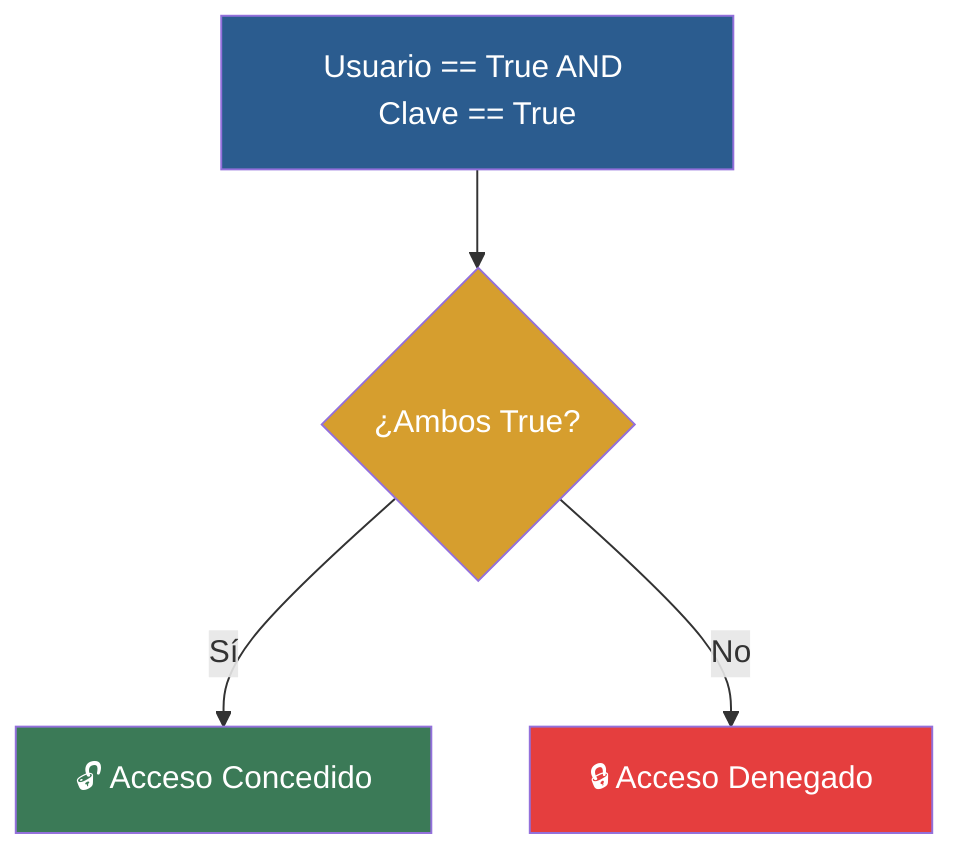

# 📑 Ejemplo 04: La Cerradura de Doble Llave (and, or, not)

> **Concepto Clave:** Combinar múltiples expresiones lógicas con and, or, not.  
> **Metáfora:** Cerradura Doble: Requerir usuario Y contraseña (and) al mismo tiempo.

---

## 📊 Diagrama de Flujo del Ejemplo



---

## 🏃‍♂️ ¿Cómo ejecutar este ejemplo?

Abre tu terminal en VS Code y ejecuta:

```bash
python 01-fundamentos-python/clase-03-control-flujo-condicionales/ejemplos/ejemplo-04-operadores-logicos-doble-llave/04_operadores_logicos_doble_llave.py
```

---

## 📄 Explicación Paso a Paso

1. Lee detenidamente los comentarios dentro del archivo [`04_operadores_logicos_doble_llave.py`](04_operadores_logicos_doble_llave.py).
2. Ejecuta el código y observa la salida en consola.
3. Revisa la sección final del archivo para ver el resumen conceptual explicativo.
