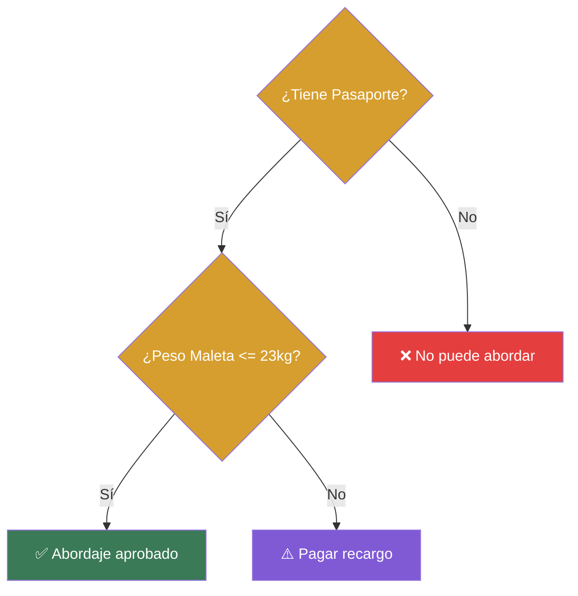

# 📑 Ejemplo 05: El Filtro del Aeropuerto (Condicionales Anidados)

> **Concepto Clave:** Estructuras if dentro de otros bloques if.  
> **Metáfora:** Control del Aeropuerto: Fase 1 (Pasaporte) -> Fase 2 (Equipaje).

---

## 📊 Diagrama de Flujo del Ejemplo



---

## 🏃‍♂️ ¿Cómo ejecutar este ejemplo?

Abre tu terminal en VS Code y ejecuta:

```bash
python 01-fundamentos-python/clase-03-control-flujo-condicionales/ejemplos/ejemplo-05-condicionales-anidados-aeropuerto/05_condicionales_anidados_aeropuerto.py
```

---

## 📄 Explicación Paso a Paso

1. Lee detenidamente los comentarios dentro del archivo [`05_condicionales_anidados_aeropuerto.py`](05_condicionales_anidados_aeropuerto.py).
2. Ejecuta el código y observa la salida en consola.
3. Revisa la sección final del archivo para ver el resumen conceptual explicativo.
