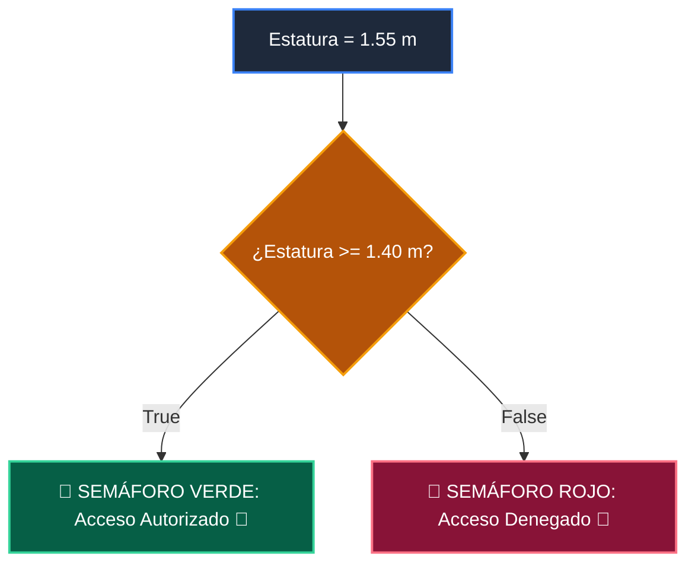

# 📖 01 If Else Simple

> **Clase:** Clase 03: Control de Flujo: Condicionales (if / elif / else)  
> **Script:** [`main.py`](main.py)  

Ejemplo 01: Condicionales Simples.

---

## 🗺️ Flujo de Ejecución del Ejemplo



---

## 💻 Ejecución desde Terminal

```bash
python 01-fundamentos-python/clase-03-control-flujo-condicionales/ejemplos/ejemplo_01_if_else_simple/main.py
```
