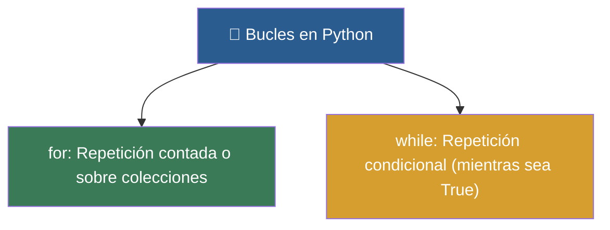

# 🔄 Clase 04: Repetición Inteligente (for y while)

> **Objetivo:** Aprender a repetir tareas automáticamente con bucles for y while, y controlar la iteración con break y continue.

---

## 💡 Diagrama Conceptual de la Clase

---

## 📚 Ejemplos Prácticos de la Clase

| Ejemplo | Concepto Principal | Metáfora del Mundo Real | Enlace al Material |
| :--- | :--- | :--- | :---: |
| **Ejemplo 01** | Generación de secuencias numéricas iterativas con range(). | *Tablero Electrónico* | [📁 Ver Ejemplo](ejemplos/ejemplo-01-for-range-las-vueltas/) |
| **Ejemplo 02** | Iterar directamente sobre los elementos de una lista. | *Pasar lista* | [📁 Ver Ejemplo](ejemplos/ejemplo-02-for-recorrer-elementos/) |
| **Ejemplo 03** | Repetición mientras se mantenga una condición booleana. | *Termostato* | [📁 Ver Ejemplo](ejemplos/ejemplo-03-while-el-termostato/) |
| **Ejemplo 04** | Interrupción manual (break) y salto de ciclo (continue). | *Freno de Emergencia* | [📁 Ver Ejemplo](ejemplos/ejemplo-04-break-continue-frenos/) |
| **Ejemplo 05** | Incrementar variables contadoras y acumuladoras. | *Alcancía* | [📁 Ver Ejemplo](ejemplos/ejemplo-05-contador-acumulador-alcancia/) |

---

## 🏋️ Ejercicio Práctico de la Clase

Revisa la carpeta de [ejercicios/](ejercicios/) para aplicar los conocimientos adquiridos.
