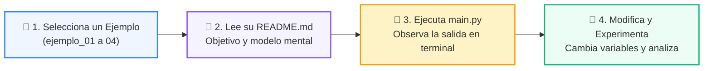

# 💻 Catálogo de Ejemplos Prácticos: Clase 04: Control de Flujo: Bucles (for / while)

> **Ubicación:** `01-fundamentos-python/clase-04-control-flujo-bucles/ejemplos`  
> **Metodología:** *La Regla de la Bicicleta (Pedaleo en VS Code)*  

Esta carpeta contiene los ejemplos de código interactivos y comentados diseñados para ver la teoría en acción.

---

## 🌀 Flujo de Experimentación y Pedaleo



---

## 📑 Ejemplos Disponibles

| Subcarpeta | Tipo de Demostración | Archivo de Código |
| :--- | :--- | :---: |
| [`ejemplo_01_for_range/`](ejemplo_01_for_range/) | Demostración paso a paso | [`main.py`](ejemplo_01_for_range/main.py) |
| [`ejemplo_02_for_secuencias/`](ejemplo_02_for_secuencias/) | Demostración paso a paso | [`main.py`](ejemplo_02_for_secuencias/main.py) |
| [`ejemplo_03_while_acumulador/`](ejemplo_03_while_acumulador/) | Demostración paso a paso | [`main.py`](ejemplo_03_while_acumulador/main.py) |
| [`ejemplo_04_break_continue/`](ejemplo_04_break_continue/) | Demostración paso a paso | [`main.py`](ejemplo_04_break_continue/main.py) |


---

## 🚀 Cómo Ejecutar los Ejemplos
Desde la terminal en la raíz del repositorio:
```bash
python 01-fundamentos-python/clase-04-control-flujo-bucles/ejemplos/<carpeta_ejemplo>/main.py
```
