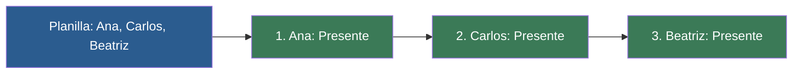

# 📑 Ejemplo 02: Pasar Lista en Clase (for en listas)

> **Concepto Clave:** Iterar directamente sobre los elementos de una lista.  
> **Metáfora:** Pasar lista: El profesor menciona cada nombre en la planilla.

---

## 📊 Diagrama de Flujo del Ejemplo



---

## 🏃‍♂️ ¿Cómo ejecutar este ejemplo?

Abre tu terminal en VS Code y ejecuta:

```bash
python 01-fundamentos-python/clase-04-control-flujo-bucles/ejemplos/ejemplo-02-for-recorrer-elementos/02_for_recorrer_elementos.py
```

---

## 📄 Explicación Paso a Paso

1. Lee detenidamente los comentarios dentro del archivo [`02_for_recorrer_elementos.py`](02_for_recorrer_elementos.py).
2. Ejecuta el código y observa la salida en consola.
3. Revisa la sección final del archivo para ver el resumen conceptual explicativo.
