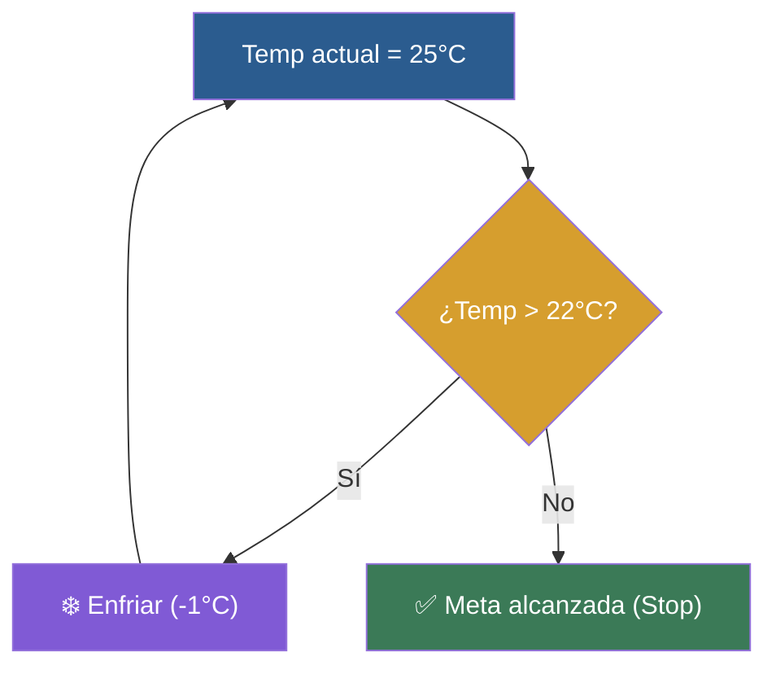

# 📑 Ejemplo 03: El Termostato Inteligente (while)

> **Concepto Clave:** Repetición mientras se mantenga una condición booleana.  
> **Metáfora:** Termostato: Enfriar MIENTRAS la temperatura sea superior a la meta.

---

## 📊 Diagrama de Flujo del Ejemplo



---

## 🏃‍♂️ ¿Cómo ejecutar este ejemplo?

Abre tu terminal en VS Code y ejecuta:

```bash
python 01-fundamentos-python/clase-04-control-flujo-bucles/ejemplos/ejemplo-03-while-el-termostato/03_while_el_termostato.py
```

---

## 📄 Explicación Paso a Paso

1. Lee detenidamente los comentarios dentro del archivo [`03_while_el_termostato.py`](03_while_el_termostato.py).
2. Ejecuta el código y observa la salida en consola.
3. Revisa la sección final del archivo para ver el resumen conceptual explicativo.
