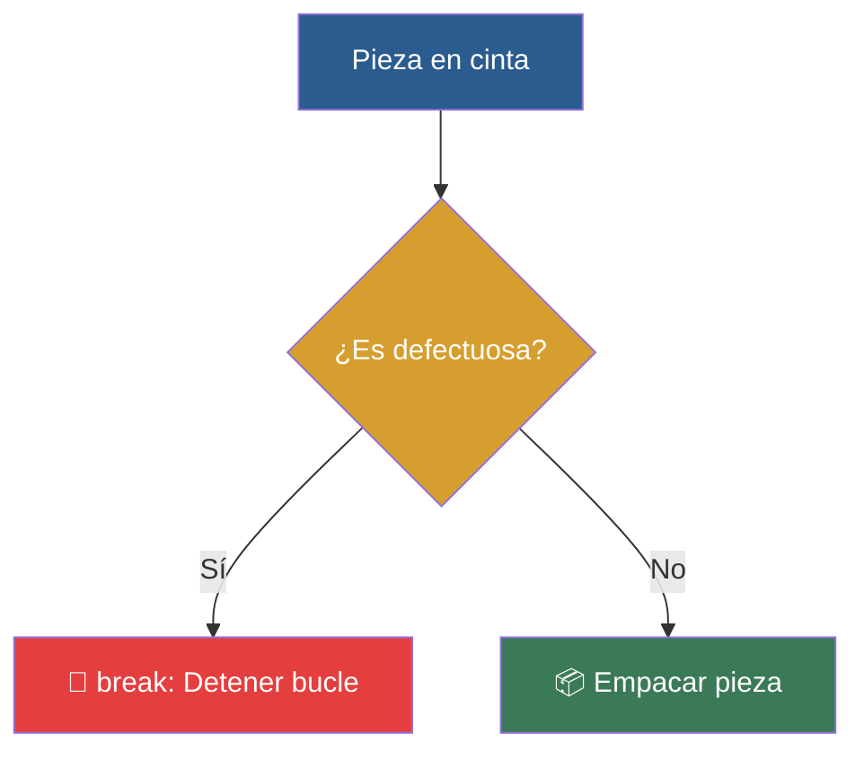

# 📑 Ejemplo 04: Frenos de Emergencia (break y continue)

> **Concepto Clave:** Interrupción manual (break) y salto de ciclo (continue).  
> **Metáfora:** Freno de Emergencia: Detener la cinta si aparece una pieza defectuosa.

---

## 📊 Diagrama de Flujo del Ejemplo



---

## 🏃‍♂️ ¿Cómo ejecutar este ejemplo?

Abre tu terminal en VS Code y ejecuta:

```bash
python 01-fundamentos-python/clase-04-control-flujo-bucles/ejemplos/ejemplo-04-break-continue-frenos/04_break_continue_frenos.py
```

---

## 📄 Explicación Paso a Paso

1. Lee detenidamente los comentarios dentro del archivo [`04_break_continue_frenos.py`](04_break_continue_frenos.py).
2. Ejecuta el código y observa la salida en consola.
3. Revisa la sección final del archivo para ver el resumen conceptual explicativo.
